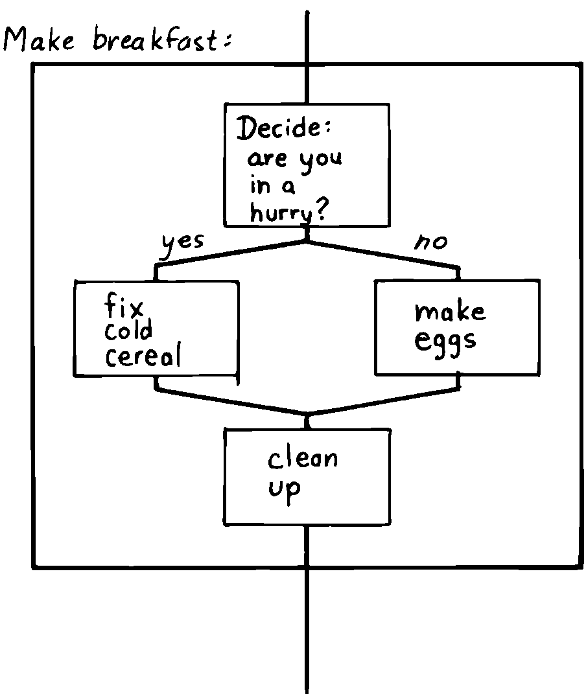
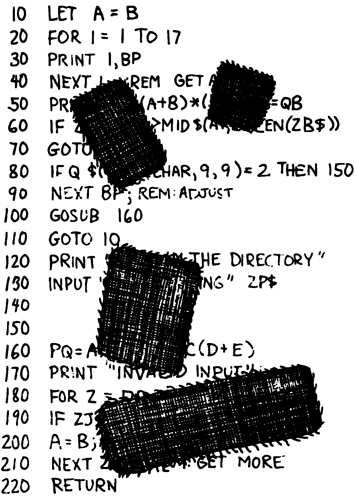
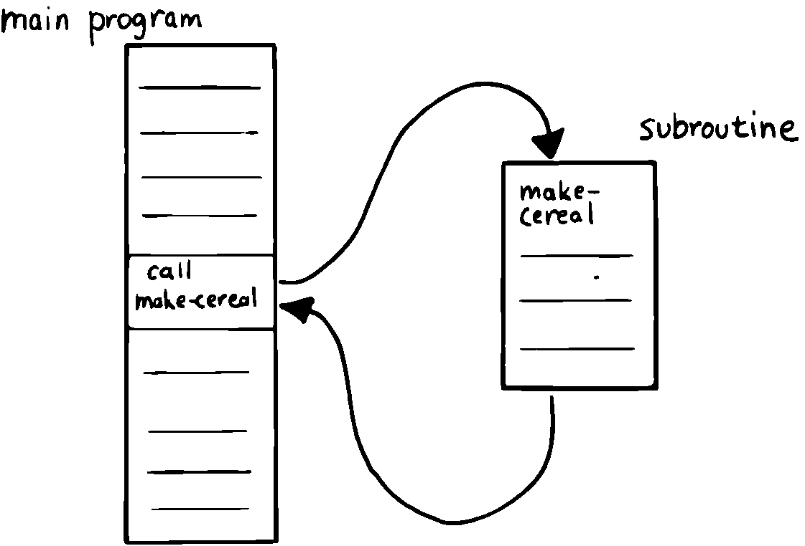
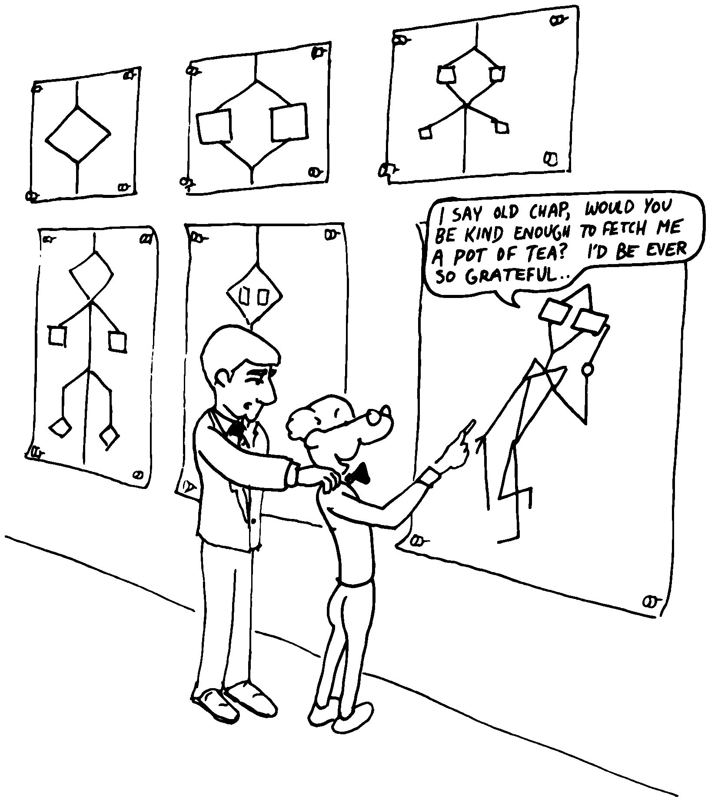

An Armchair History of Software Elegance
========================================

In the prehistoric days of programming, when computers were dinosaurs,
the mere fact that some genius could make a program run correctly
provided great cause for wonderment. As computers became more civilized,
the wonder waned. Management wanted more from programmers and from their
programs.

As the cost of hardware steadily dropped, the cost of software soared.
It was no longer good enough for a program to run correctly. It also had
to be developed quickly and maintained easily. A new demand began to
share the spotlight with correctness. The missing quality was called
“elegance.”

In this section we’ll outline a history of the tools and techniques for
writing more elegant programs.

Memorability
------------

The first computer programs looked something like this:

00110101 11010011 11011001

Programmers entered these programs by setting rows of switches—“on” if
the digit was “1,” “off” if the digit was “0.” These values were the
“machine instructions” for the computer, and each one caused the
computer to perform some mundane operation like “Move the contents or
Register B to Register A,” or “Add the contents of Register C into the
contents of Register A.”

This proved a bit tedious.

Tedium being the stepmother of invention, some clever programmers
realized that the computer itself could be used to help. So they wrote a
program that translated easy-to-remember abbreviations into the
hard-to-remember bit patterns. The new language looked something like
this:

MOV B,A ADD C,A JMC REC1

The translator program was called an *assembler*, the new language
*assembly language*. Each instruction “assembled” the appropriate bit
pattern for that instruction, with a one-to-one correspondence between
assembly instruction and machine instruction. But names are easier for
programmers to remember. For this reason the new instructions were
called *mnemonics*.

Power
-----

Assembly-language programming is characterized by a one-for-one
correspondence between each command that the programmer types and each
command that the processor performs.

In practice, programmers found themselves often repeating the same
*sequence* of instructions over and again to accomplish the same thing
in different parts of the program. How nice it would be to have a name
which would represent each of these common sequences.

This need was met by the “macro assembler,” a more complicated assembler
that could recognize not only normal instructions, but also special
names (“macros”). For each name, the macro assembler assembles the five
or ten machine instructions represented by the name, just as though the
programmer had written them out in full.

   
   So then I typed GOTO 500---and here I am!

Abstraction
-----------

A major advance was the invention of the “high-level language.” Again
this was a translator program, but a more powerful one. High-level
languages make it possible for programmers to write code like this:

X = Y (456/A) - 2

which looks a lot like algebra. Thanks to high-level languages,
engineers, not just bizarre bit-jockeys, could start writing programs.
BASIC and FORTRAN are examples of high-level languages.

High-level languages are clearly more “powerful” than assembly languages
in the sense that each instruction might compile dozens of machine
instructions. But more significantly, high-level languages eliminate the
linear correspondence between source code and the resulting machine
instructions.

The actual instructions depend on each entire “statement” of source code
taken as a whole. Operators such as :math:`+` and :math:`=` have no
meaning by themselves. They are merely part of a complex symbology that
depends upon syntax and the operator’s location in the statement.

This nonlinear, syntax-dependent correspondence between source and
object code is widely considered to be an invaluable step in the
progress of programming methodology. But as we’ll see, the approach
ultimately offers more restriction than freedom.

Manageability
-------------

Most computer programs involve much more than lists of instructions to
work down from start to finish. They also involve testing for various
conditions and then “branching” to the appropriate parts of the code
depending upon the outcome. They also involve “looping” over the same
sections of code repeatedly, usually testing for the moment to branch
out of the loop.

Both assembler and high-level languages provide branching and looping
capabilities. In assembly languages you use “jump instructions;” in some
high-level languages you use “GO TO” commands. When these capabilities
are used in the most brute-force way, programs tend to look like the
jumble you see in .

This approach, still widely used in languages like FORTRAN and BASIC,
suffers from being difficult to write and difficult to change if
corrections need to be made. In this “bowl-of-spaghetti” school of
programming, it’s impossible to test a single part of the code or to
figure out how something is getting executed that isn’t supposed to be
getting executed.

Difficulties with spaghetti programs led to the discovery of “flow
charts.” These were pen-and-ink drawings representing the “flow” of
execution used by the programmer as an aid to understanding the code
being written. Unfortunately the programmer had to make the translation
from code to flow chart and back by hand. Many programmers found
old-fashioned flow charts less than useful.

Modularity
----------

A significant advance arose with the invention of “Structured
Programming,” a methodology based on the observation that large problems
are more easily solved if treated as collections of smaller problems
:raw-latex:`\cite{dahl72}`. Each piece is called a *module*. Programs
consist of modules within modules.

Structured programming eliminates spaghetti coding by insisting that
control flow can be diverted only within a module. You can’t jump out
from the middle of one module into the middle of another module.

For example, shows a structured diagram of a module to “Make Breakfast,”
which consists of four submodules. Within each submodule you’ll find a
whole new level of complexity which needn’t be shown at this level.

   
   Design for a structured program

A branching decision occurs in this module to choose between the “cold
cereal” module and the “eggs” module, but control flow stays within the
outer module

Structured programming has three premises:

#. Every program is described as a linear sequence of self-contained
   functions, called *modules*. Each module has exactly one entry point
   and one exit point.

#. Each module consists of one or more functions, each of which has
   exactly one entry point and one exit point and can itself be
   described as a module.

#. A module can contain:

   #. operations or other modules

   #. decision structures ( statements)

   #. looping structures

The idea of modules having “one-entry, one-exit” is that you can unplug
them, change their innards, and plug them back in, without screwing up
the connections with the rest of the program. This means you can test
each piece by itself. That’s only possible if you know exactly where you
stand when you start the module, and where you stand when you leave it.

In “Make Breakfast” you’ll either fix cereal or make eggs, not both. And
you’ll always clean up. (Some programmers I know circumvent this last
module by renting a new apartment every three months.)

Structured programming was originally conceived as a design approach.
Modules were imaginary entities that existed in the mind of the
programmer or designer, not actual units of source code. When structured
programming design techniques are applied to non-structured languages
like BASIC, the result looks something like .

Writeability
------------

Yet another breakthrough encouraged the use of structured programs:
structured programming languages. These languages include control
structures in their command sets, so you can write programs that have a
more modular appearance. Pascal is such a language, invented by to teach
the principles of structured programming to his students.

shows how this type of language would allow “Make Breakfast” to be
written.

Structured programming languages include control structure operators
such as and to ensure a modularity of control flow. As you can see,
indentation is important for readability, since all the instructions
within each module are still written out rather than being referred to
by name (e.g., “”). The finished program might take ten pages, with the
on page five.

Designing from the Top
----------------------

How does one go about designing these modules? A methodology called
“top-down design” proclaims that modules should be designed in order
starting with the most general, overall module and working down to the
nitty-gritty modules.

Proponents of top-down design have witnessed shameful wastes of time due
to lack of planning. They’ve learned through painful experience that
trying to correct programs after they’ve been written—a practice known
as “patching”—is like locking the barn door after the horse has bolted.

So they offer as a countermeasure this official rule of top-down
programming:

Write no code until you have planned every last detail.

Because programs are so difficult to change once they’ve been written,
any design oversight at the preliminary planning stage should be
revealed before the actual code-level modules are written, according to
the top-down design, Otherwise, man-years of effort may be wasted
writing code that cannot be used.

   
   Software patches are ugly and conceal structural weaknesses.

Subroutines
-----------

We’ve been discussing “modules” as abstract entities only. But all
high-level programming languages incorporate techniques that allow
modules of design to be coded as modules of code—discrete units that can
be given names and “invoked” by other pieces of code. These units are
called subroutines, procedures, or functions, depending on the
particular high-level language and on how they happen to be implemented.

Suppose we write “” as a subroutine. It might look something like this:

procedure make-cereal get clean bowl open cereal box pour cereal open
milk pour milk get spoon end

We can also write “” and “” as subroutines. Elsewhere we can define “”
as a simple routine that invokes, or calls, these subroutines:

procedure make-breakfast var h: boolean (indicates hurried) &textittest
for hurried if h = true then &textbfcall make-cereal else &textbfcall
make-eggs end &textbfcall cleanup end

The phrase “call make-cereal” causes the subroutine named “make-cereal”
to be executed. When the subroutine has finished being executed, control
returns back to the calling program at the point following the call.
Subroutines obey the rules of structured programming.

As you can see, the effect of the subroutine call is as if the
subroutine code were written out in full within the calling module. But
unlike the code produced by the macro assembler, the subroutine can be
compiled elsewhere in memory and merely referenced. It doesn’t
necessarily have to be compiled within the object code of the main
program ().

   
   A main program and a subroutine in memory.

Over the years computer scientists have become more forceful in favoring
the use of many small subroutines over long-winded, continuous programs.
Subroutines can be written and tested independently. This makes it
easier to reuse parts of previously written programs, and easier to
assign different parts of a program to different programmers. Smaller
pieces of code are easier to think about and easier to verify for
correctness.

When subroutines are compiled in separate parts of memory and referred
to you can invoke the same subroutine many times throughout a program
without wasting space on repeated object code. Thus the judicious use of
subroutines can also decrease program size.

Unfortunately, there’s a penalty in execution speed when you use a
subroutine. One problem is the overhead in saving registers before
jumping to the subroutine and restoring them afterwards. Even more
time-consuming is the invisible but significant code needed to pass
parameters to and from the subroutine.

Subroutines are also fussy about how you invoke them and particularly
how you pass data to and from them. To test them independently you need
to write a special testing program to call them from.

For these reasons computer scientists recommend their use in moderation.
In practice subroutines are usually fairly large between a half page to
a full page of source code in length.

Successive Refinement
---------------------

An approach that relies heavily on subroutines is called “Successive
Refinement” :raw-latex:`\cite{wirth71}`. The idea is that you begin by
writing a skeletal version of your program using natural names for
procedures for data structures. Then you write versions of each of the
named procedures. You continue this process to greater levels of detail
until the procedures can only be written in the computer language
itself.

At each step the programmer must make decisions about the algorithms
being used and about the data structures they’re being used on.
Decisions about the algorithms and associated data structures should be
made in parallel.

If an approach doesn’t work out the programmer is encouraged to back
track as far as necessary and start again.

Notice this about successive refinement: You can’t actually run any part
of the program until its lowest-level components are written. Typically
this means you can’t test the program until after you’ve completely
designed it.

Also notice: Successive refinement forces you to work out all details of
control structure on each level before proceeding to the next lower
level.

   
   Tobias, I think you've carried the successive refinement of that module far enough.

Structured Design
-----------------

By the middle of late ’70s, the computing industry had tried all the
concepts we’ve described, and it was still unhappy. The cost of
maintaining software—keeping it functional in the face of
change—accounted for more than half of the total cost of software, in
some estimates as much as ninety percent!

Everyone agreed that these atrocities could usually be traced back to
incomplete analysis of the program, or poorly thought-out designs. Not
that there was anything wrong with structured programming *per se*. When
projects came in late, incomplete, or incorrect, the designers took the
blame for not anticipating the unforeseen.

Scholars naturally responded by placing more emphasis on design. “Next
time let’s think things out better.”

About this time a new philosophy arose, described in an article called
“Structured Design” :raw-latex:`\cite{stevens74-1}`. One of its
principles is stated in this paragraph:

Simplicity is the primary measurement recommended for evaluating
alternative designs relative to reduced debugging and modification time.
Simplicity can be enhanced by dividing the system into separate pieces
in such a way that pieces can be considered, implemented, fixed and
changed with minimal consideration or effect on the other pieces of the
system.

By dividing a problem into simple modules, programs were expected to be
easier to write, easier to change, and easier to understand.

But what is a module, and on what basis does one make the divisions?
“Structured Design” outlines three factors for designing modules.

Functional Strength
-------------------

One factor is something called “functional strength,” which is a measure
of the uniformity of purpose of all the statements within a module. If
all the statements inside the module collectively can be thought of as
performing a single task, they are functionally bound.

You can generally tell whether the statements in a module are
functionally bound by asking the following questions. First, can you
describe its purpose in one sentence? If not, the module is probably not
functionally bound. Next, ask these four questions about the module:

#. Does the description have to be a compound sentence?

#. Does it use words involving time, such as “first,” “next,” “then,”
   etc.?

#. Does it use a general or nonspecific object following the verb?

#. Does it use words like “initialize” which imply a lot of different
   functions being done at the same time?

If the answer to any of these four questions is “yes,” you’re looking at
some less cohesive type of binding than functional binding. Weaker forms
of binding include:

Coincidental binding:
    (the statements just happen to appear in the same module)

Logical binding:
    (the module has several related functions and requires a flag or
    parameter to decide which particular function to perform)

Temporal binding:
    (the module contains a group of statements that happen at the same
    time, such as initialization but have no other relationship)

Communicational binding:
    (the module contains a group of statements that all refer to the
    same set of data)

Sequential binding:
    (where the output of one statement serves as input for the next
    statement)

Our “” module exhibits functional binding, because it can be thought of
as doing one thing, even though it consists of several subordinate
tasks.

Coupling
--------

A second tenet of structured design concerns “coupling,” a measure of
how modules influence the behavior of other modules. Strong coupling is
considered bad form. The worst case is when one module actually modifies
code inside another module. Even passing control flags to other modules
with the intent to control their function is dangerous.

An acceptable form of coupling is “data coupling,” which involves
passing data (not control information) from one module to another. Even
then, systems are easiest to build and maintain when the data interfaces
between modules are as simple as possible.

When data can be accessed by many modules (for instance, global
variables), there’s stronger coupling between the modules. If a
programmer needs to change one module, there’s a greater danger that the
other modules will exhibit “side effects.”

The safest kind of data coupling is the passing of local variables as
parameters from one module to another. The calling module says to the
subordinate module, in effect, “I want you to use the data I’ve put in
these variables named X and Y, and when you’re done, I expect you to
have put the answer in the variable named Z. No one else will use these
variables.”

As we said, conventional languages that support subroutines include
elaborate methods of passing arguments from one module to another.

Hierarchical Input-Process-Output Designing
-------------------------------------------

A third precept of structured design concerns the design process.
Designers are advised to use a top-down approach, but to pay less
attention initially to control structures. “Decision designing” can wait
until the later, detailed design of modules. Instead, the early design
should focus on the program’s hierarchy (which modules call which
modules) and to the passing of data from one module to another.

To help designers think along these new lines, a graphic representation
was invented, called the “structure chart.” (A slightly different form
is called the “HIPO chart,” which stands for “hierarchical
input-process-output.”) Structure charts include two parts, a hierarchy
chart and an input-output chart.

shows these two parts. The main program, called DOIT, consists of three
subordinate modules, which in turn invoke the other modules shown below
them. As you can see, the design emphasizes the transformation of input
to output.

The tiny numbers of the hierarchy chart refer to the lines on the in-out
chart. At point 1 (the module READ), the output is the value A. At point
2 (the module TRANSFORM-TO-B), the input is A, and the output is B.

Perhaps the greatest contribution of this approach is recognizing that
decisions about control flow should not dominate the emerging design. As
we’ll see, control flow is a superficial aspect of the problem. Minor
changes in the requirements can profoundly change the program’s control
structures, and “deep-six” years of work. But if programs are designed
around other concerns, such as the flow of data, then a change in plan
won’t have so disastrous an effect.

Information-Hiding 
-------------------

In a paper :raw-latex:`\cite{parnas72}` published back in 1972, Dr.
showed that the criteria for decomposing modules should not be steps in
the process, but rather pieces of information that might possibly
change. Modules should be used to hide such information.

Let’s look at this important idea of “information-hiding”: Suppose you
are writing a Procedures Manual for your company. Here’s a portion:

| Sales Dept. takes order
| sends blue copy to Bookkeeping
| orange copy to Shipping

Jay logs the orange copy in the red binder on his desk, and completes
packing slip.

Everyone agrees that this procedure is correct, and your manual gets
distributed to everyone in the company.

Then Jay quits, and Marilyn takes over. The new duplicate forms have
green and yellow sheets, not blue and orange. The red binder fills up
and gets replaced with a black one.

Your entire manual is obsolete. You could have avoided the obsolescence
by using the term “Shipping Clerk” instead of the name “Jay,” the terms
“Bookkeeping Dept. copy” and “Shipping Dept. copy” instead of “blue” and
“orange,” etc.

This example illustrates that in order to maintain correctness in the
face of a changing environment, arbitrary details should be excluded
from procedures. The details can be recorded elsewhere if necessary. For
instance, every week or so the personnel department might issue a list
of employees and their job titles, so anyone who needed to know who the
shipping clerk was could look it up in this single source. As the
personnel changes, this list would change.

This technique is very important in writing software. Why would a
program ever need to change, once it’s running? For any of a million
reasons. You might want to run an old program on new equipment; the
program must be changed just enough to accommodate the new hardware. The
program might not be fast enough, or powerful enough, to suit the people
who are using it. Most software groups find themselves writing
“families” of programs; that is, many versions of related programs in
their particular application field, each a variant on an earlier
program.

To apply the principle of information-hiding to software, certain
details of the program should be confined to a single location, and any
useful piece of information should be expressed only once. Programs that
ignore this maxim are guilty of redundancy. While hardware redundancy
(backup computers, etc.) can make a system more secure, redundancy of
information is dangerous.

As any knowledgeable programmer will tell you, a number that might
conceivably change in future versions of the program should be made into
a “constant” and referred to throughout the program by name, not by
value. For instance, the number of columns representing the width of
your computer paper forms should be expressed as a constant. Even
assembly languages provide “”s and labels for associating values such as
addresses and bit-patterns with names.

Any good programmer will also apply the concept of information-hiding to
the development of subroutines, ensuring that each module knows as
little as possible about the insides of other modules. Contemporary
programming languages such as C, Modula 2, and Edison apply this concept
to the architecture of their procedures.

But takes the idea much further. He suggests that the concept should be
extended to algorithms and data structures. In fact, hiding
information—not decision-structure or calling-hierarchy—should be the
primary basis for design!
