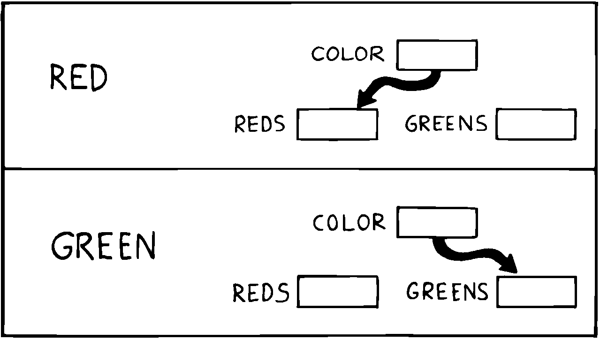

Hiding the Construction of Data Structures
==========================================

We’ve noted two inventions of Forth that make possible the methodology
we’ve described—implicit calls and implicit data passing. A third
feature allows the data structures within a component to be described in
terms of previously-defined components. This feature is direct access
memory.

Suppose we define a variable called , like this:

VARIABLE APPLES

We can store a number into this variable to indicate how many apples we
currently have:

20 APPLES !

We can display the contents of the variable:

APPLES ? &underline20 ok

We can up the count by one:

1 APPLES +!

(The newcomer can study the mechanics of these phrases in Appendix A.)

The word has but one function: to put on the stack the *address* of the
memory location where the tally of apples is kept. The tally can be
thought of as a “thing,” while the words that set the tally, read the
tally, or increment the tally can be considered as “actions.”

Forth conveniently separates “things” from “actions” by allowing
addresses of data structures to be passed on the stack and providing the
“fetch” and “store” commands.

We’ve discussed the importance of designing around things that may
change. Suppose we’ve written a lot of code using this variable . And
now, at the eleventh hour, we discover that we must keep track of two
different kinds of apples, red and green!

We needn’t wring our hands, but rather remember the function of : to
provide an address. If we need two separate tallies, can supply two
different addresses depending on which kind of apple we’re currently
talking about. So we define a more complicated version of as follows:

VARIABLE COLOR ( pointer to current tally) VARIABLE REDS ( tally of red
apples) VARIABLE GREENS ( tally of green apples) : RED ( set apple-type
to RED) REDS COLOR ! ; : GREEN ( set apple-type to GREEN) GREENS COLOR !
; : APPLES ( – adr of current apple tally) COLOR @ ;

   
   Changing the indirect pointer.

Here we’ve redefined Now it fetches the contents of a variable called is
a pointer, either to the variable or to the variable These two variables
are the real tallies.

If we first say then we can use to refer to red apples. If we say we can
use it to refer to green apples ().

We didn’t need to change the syntax of any existing code that uses We
can still say

20 APPLES !

and

1 APPLES +!

Look again at what we did. We changed the definition of from that of a
variable to a colon definition, without affecting its usage. Forth
allows us to hide the details of how is defined from the code that uses
it. What appears to be “thing” (a variable) to the original code is
actually defined as an “action” (a colon definition) within the
component.

Forth encourages the use of abstract data types by allowing data
structures to be defined in terms of lower level components. Only Forth,
which eliminates the CALLs from procedures, which allows addresses and
data to be implicitly passed via the stack, and which provides direct
access to memory locations with and , can offer this level of
information-hiding.

Forth pays little attention to whether something is a data structure or
an algorithm. This indifference allows us programmers incredible freedom
in creating the parts of speech we need to describe our applications.

I tend to think of any word which returns an address, such as as a
“noun,” regardless of how it’s defined. A word that performs an obvious
action is a “verb.”

Words such as and in our example can only be called “adjectives” since
they modify the function of The phrase

RED APPLES ?

is different from

GREEN APPLES ?

Forth words can also serve as adverbs and prepositions. There’s little
value in trying to determine what part of speech a particular word is,
since Forth doesn’t care anyway. We need only enjoy the ease of
describing an application in natural terms.
