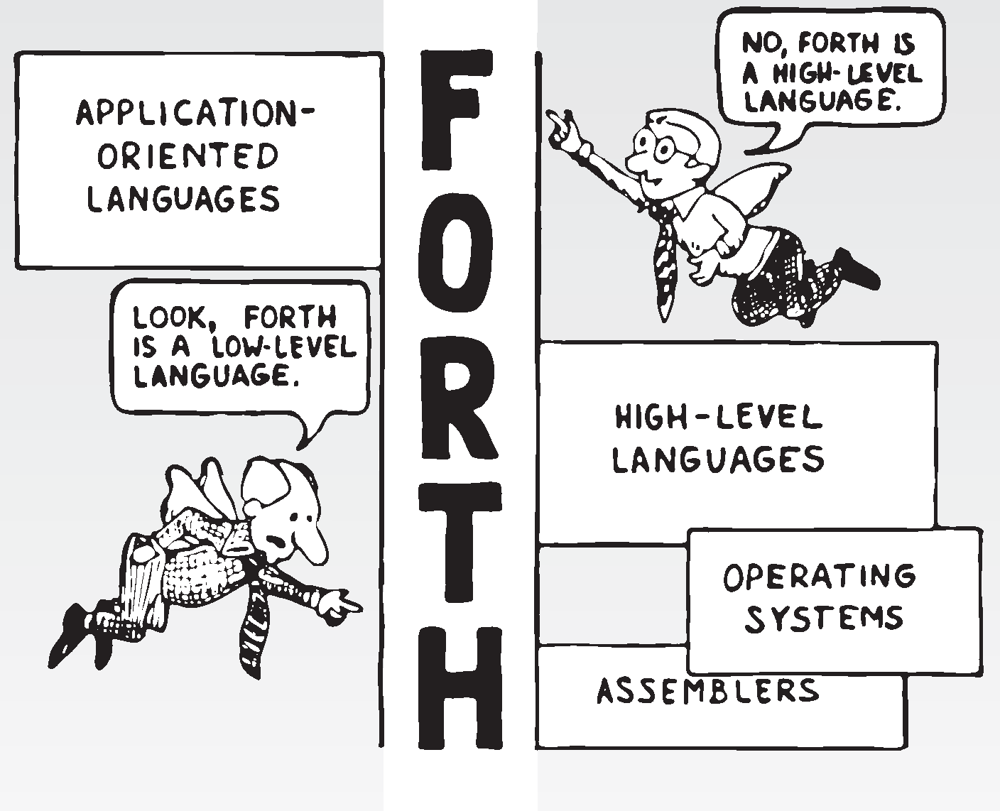
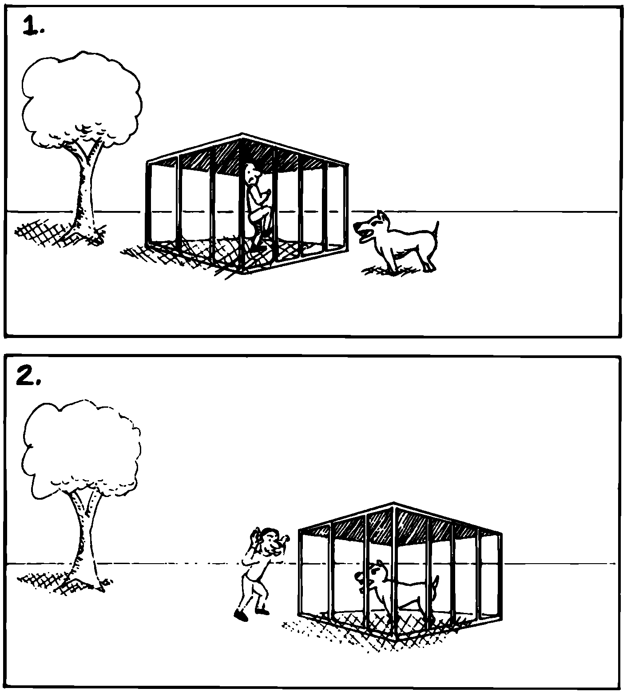

But Is It a High-Level Language?
================================

In our brief technical overview, we noted that traditional high-level
languages broke away from assembly-language by eliminating not only the
*one-for-one* correspondence between commands and machine operations,
but also the *linear* correspondence. Clearly Forth lays claim to the
first difference; but regarding the second, the order of words that you
use in a definition is the order in which those commands are compiled.

Does this disqualify Forth from the ranks of high-level languages?
Before we answer, let’s explore the advantages of the Forth approach.

   
   Two points of view.

Here’s what , the inventor of Forth, has to say:

You define each word so that the computer knows what it means. The way
it knows is that it executes some code as a consequence of being
invoked. The computer takes an action on every word. It doesn’t store
the word away and keep it in mind for later.

In a philosophical sense I think this means that the computer
“understands” a word. It understands the word , perhaps more profoundly
than you do, because there’s never any question in its mind what means.

The connection between words that have meaning to you and words that
have meaning to the computer is a profound one. The computer becomes the
vehicle for communication between human being and concept.

One advantage of the correspondence between source code and machine
execution is the tremendous simplification of the compiler and
interpreter. This simplification improves performance in several ways,
as we’ll see in a later section.

From the standpoint of programming methodology, the advantage to the
Forth approach is that *new* words and *new* syntaxes can easily be
added. Forth cannot be said to be “looking” for words—it finds words and
executes them. If you add new words Forth will find and execute them as
well. There’s no difference between existing words and words that you
add.

What’s more, this “extensibility” applies to all types of words, not
just action-type functions. For instance, Forth allows you to add new
*compiling* words—like and that provide structured control flow. You can
easily add a case statement or a multiple-exit loop if you need them,
or, just as importantly, take them out if you don’t need them.

By contrast, any language that depends on word order to understand a
statement must “know” all legal words and all legal combinations. Its
chances of including all the constructs you’d like are slim. The
language exists as determined by its manufacturer; you can’t extend its
knowledge.

Laboratory researchers cite flexibility and extensibility as among
Forth’s most important benefits in their environment. Lexicons can be
developed to hide information about the variety of test equipment
attached to the computer. Once this work has been done by a more
experienced programmer, the researchers are free to use their “software
toolbox” of small words to write simple programs for experimentation. As
new equipment appears, new lexicons are added.

has described the problem of using an off-the-shelf special-purpose
procedure library in the laboratory :raw-latex:`\cite{bern83}`: “The
computer, not the user, dominates the experiment.” But with Forth, he
writes, “the computer actually encourages scientists to modify, repair,
and improve the software, to experiment with and characterize their
equipment. Initiative becomes once more the prerogative of the
researcher.”

   
   Two solutions to the problem of security.

For those purists who believe Forth isn’t fit to be called a high-level
language, Forth makes matters even worse. While strong syntax checking
and data typing are becoming one of the major thrusts of contemporary
programming languages, Forth does almost no syntax checking at all. In
order to provide the kind of freedom and flexibility we have described,
it cannot tell you that you meant to type instead of . You have just
invented syntax!

Yet Forth more than makes up for its omission by letting you compile
each definition, one at a time, with turnaround on the order of seconds.
You discover your mistake soon enough when the definition doesn’t work.
In addition, you can add appropriate syntax checking in your definitions
if you want to.

An artist’s paintbrush doesn’t notify the artist of a mistake; the
painter will be the judge of that. The chef’s skillet and the composer’s
piano remain simple and yielding. Why let a programming language try to
out think you?

So is Forth a high-level language? On the question of syntax checking,
it strikes out. On the question of abstraction and power, it seems to be
of *infinite* level—supporting everything from bit manipulation at an
output port to business applications.

You decide. (Forth doesn’t care.)
