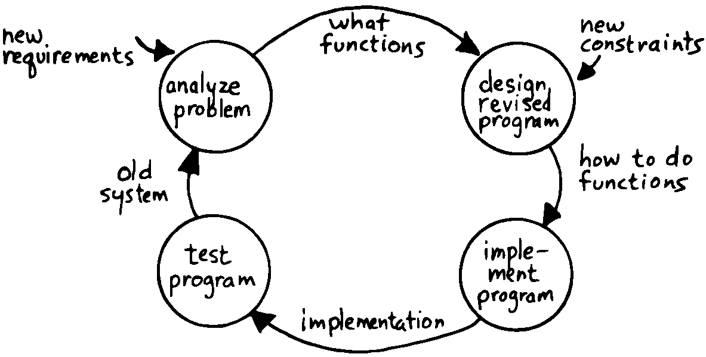

The Iterative Approach
======================

The iterative approach was explained eloquently by
:raw-latex:`\cite{harris81}`. He begins by describing the scientific
method:

… a never-ending cycle of discovery and refinement. It first studies a
natural system and gathers observations about its behavior. Then the
observations are modeled to produce a theory about the natural system.
Next, analysis tools are applied to the model, which produces
predictions about the real system’s behavior. Experiments are devised to
compare actual behavior to the predicted behavior. The natural system is
again studied, and the model is revised.

   software development cycle, from ``The {Forth}{} Philosophy,''
   by \person{Kim Harris}, \emph{Dr.\@ Dobb's Journal.}

       The iterative approach to the
    software development cycle, from ``The {Forth}{} Philosophy,''
    by \person{Kim Harris}, \emph{Dr.\@ Dobb's Journal.}

The *goal* of the method is to produce a model which accurately predicts
all observable behavior of the natural system.

then applies the scientific method to the software development cycle,
illustrated in :

#. A problem is analyzed to determine what functions are required in the
   solution.

#. Decisions are made about how to achieve those functions with the
   available resources.

#. A program is written which attempts to implement the design.

#. The program is tested to determine if the functions were implemented
   correctly.

Mr. adds:

Software development in Forth seeks first to find the simplest solution
to a given problem. This is done by implementing selected parts of the
problem separately and by ignoring as many constraints as possible. Then
one or a few constraints are imposed and the program is modified.

An excellent testimonial to the development/testing model of design is
evolution. From protozoa to tadpoles to people, each species along the
way has consisted of functional, living beings. The Creator does not
appear to be a top-down designer.

Start simple. Get it running. Learn what you’re trying to do. Add
complexity gradually, as needed to fit the requirements and constraints.
Don’t be afraid to restart from scratch.
