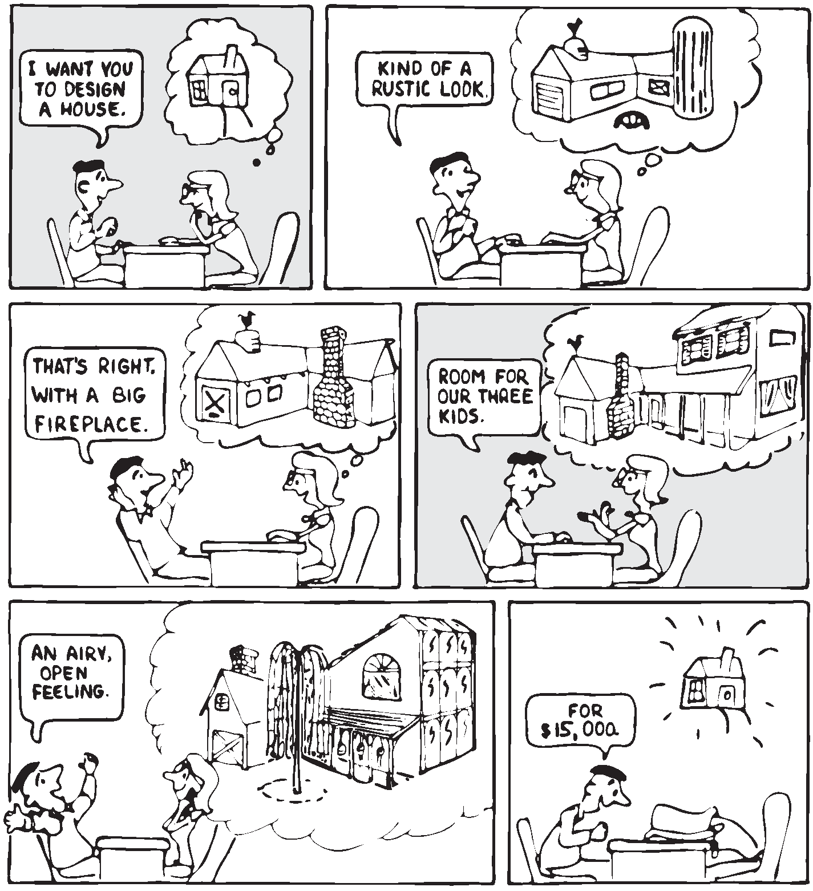
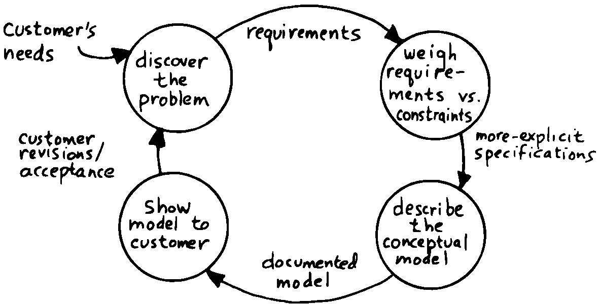

The Analysis Phase
==================

In the remainder of this chapter we’ll discuss the analysis phase.
Analysis is an organized way of understanding and documenting what the
program should do.

With a simple program that you write for yourself in less than an hour,
the analysis phase may take about 250 microseconds. At the other
extreme, some projects will take many man-years to build. On such a
project, the analysis phase is critical to the success of the entire
project.

We’ve indicated three parts to the analysis phase:

#. Discovering the requirements and constraints

#. Building a conceptual model of the solution

#. Estimating cost, scheduling, and performance

Let’s briefly describe each part:

Discovering the Requirements
----------------------------

The first step is to determine what the application should do. The
customer, or whoever wants the system, should supply a “requirements
specification.” This is a modest document that lists the minimum
capabilities for the finished product.

The analyst may also probe further by conducting interviews and sending
out questionnaires to the users.

Discovering the Constraints
---------------------------

The next step is to discover any limiting factors. How important is
speed? How much memory is available? How soon do you need it?

No matter how sophisticated our technology becomes, programmers will
always be bucking limitations. System capacities inexplicably diminish
over time. The double-density disk drives that once were the answer to
my storage prayers no longer fill the bill. The double-sided,
double-density drives I’ll get next will seem like a vast frontier—for a
while. I’ve heard guys with 10-megabyte hard disks complain of feeling
cramped.

Whenever there’s a shortage of something—and there always will
be—tradeoffs have to be made. It’s best to use the analysis phase to
anticipate most limitations and decide which tradeoffs to make.

On the other hand, you should *not* consider other types of constraints
during analysis, but should instead impose them gradually during
implementation, the way one stirs flour into gravy.

The type of constraint to consider during analysis includes those that
might affect the overall approach. The type to defer includes those that
can be handled by making iterative refinements to the planned software
design.

As we heard in our earlier interviews, finding out about *hardware*
constraints often requires writing some test code and trying things out.

Finding out about the *customer’s* constraints is usually a matter of
asking the customer, or of taking written surveys. “How fast do you need
such-and-such, on a scale of one to ten?”, etc.

Building a Conceptual Model of the Solution
-------------------------------------------

A conceptual model is an imaginary solution to the problem. It is a view
of how the system *appears* to work. It is an answer to all the
requirements and constraints.

   requirements and constraints.
   

    requirements and constraints.

If the requirements definition is for “something to stand on to paint
the ceiling,” then a description of the conceptual model is “a device
that is free-standing (so you can paint the center of the room), with
several steps spaced at convenient intervals (so you can climb up and
down), and having a small shelf near the top (to hold your paint can).”

A conceptual model is not quite a design, however. A design begins to
describe how the system *really* works. In design, the image of a step
ladder would begin to emerge.

Forth blurs the distinction a little, because all definitions are
written in conceptual terms, using the lexicons of lower level
components. In fact, later in this chapter we’ll use Forth “pseudocode”
to describe conceptual model solutions.

Nevertheless, it’s useful to make the distinction. A conceptual model is
more flexible than a design. It’s easier to fit the requirements and
constraints into the model than into a design.

Strive to build a solid conceptual model before beginning the design.

Analysis consists of expanding the requirements definition into a
conceptual model. The technique involves two-way communication with the
customer in successive attempts to describe the model.

Like the entire development cycle, the analysis phase is best approached
iteratively. Each new requirement will tend to suggest something in your
mental model. Your job is to juggle all the requirements and constraints
until you can weave a pattern that fits the bill.

   
   An iterative approach to analysis.

illustrates the iterative approach to the analysis phase. The final step
is one of the most important: show the documented model to the customer.
Use whatever means of communication are necessary—diagrams, tables, or
cartoons—to convey your understanding to the customer and get the needed
feedback. Even if you cycle through this loop a hundred times, it’s
worth the effort.

In the next three sections we’ll explore three techniques for defining
and documenting the conceptual model:

#. defining the interfaces

#. defining the rules

#. defining the data structures.
