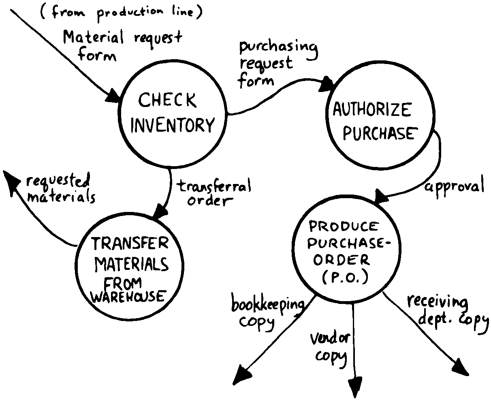

Defining the Interfaces
=======================

First, and most importantly, the conceptual model should describe the
system’s interfaces.

:

The “spec” basically deals with WHAT. In its most glorious form, it
describes what the system would look like to the user—you might call it
the user’s manual. I find I write more notes on the human
interaction—what it will look like on the outside—than on the part that
gets the job done. For instance, I’ll include a whole error-action
listing to show what happens when a particular error occurs. Oddly, this
is the part that takes the most time to implement anyway.

I’m currently working on a solid-state industrial washing-machine timer.
In this case, the user interface is not that complex. What is complex is
the interface to the washing machine, for which I must depend on the
customer and the documentation they can provide.

The significant interface is whatever is the arms and legs of the
product. I don’t make the distinction between hardware and software at
this early stage. They can be interchanged in the implementation.

The process of designing hardware and the process of designing software
are analogous. The way I design hardware is to treat it as a black box.
The front panel is input and output. You can do the same with software.

I use any techniques, diagrams, etc., to show the customer what the
inputs and outputs look like, using his description of what the product
has to do. But in parallel, in my own mind, I’m imagining how it will be
implemented. I’m evaluating whether I can do this efficiently. So to me
it’s not a black box, it’s a gray box. The designer must be able to see
inside the black boxes.

When I design a system that’s got different modules, I try to make the
coupling as rational and as little as possible. But there’s always give
and take, since you’re compromising the ideal.

For the document itself, I use DFDs [data-flow diagrams, which we’ll
discuss later], and any other kind of representation that I can show to
my client. I show them as many diagrams as I can to clarify my
understanding. I don’t generally use these once it comes to
implementation. The prose must be complete, even without reference to
the diagrams.

Decide on error- and exception-handling early as part of defining the
interface.

It’s true that when coding for oneself, a programmer can often
concentrate first on making the code run correctly under *normal*
conditions, then worry about error-handling later. When working for
someone else, however, error-handling should be worked out ahead of
time. This is an area often overlooked by the beginning programmer.

The reason it’s so important to decide on error-handling at this stage
is the wide divergence in how errors can be treated. An error might be:

-  ignored

-  made to set a flag indicating that an error occurred, while
   processing continues

-  made to halt the application immediately

-  designed to initiate procedures to correct the problem and keep the
   program running.

There’s room for a serious communications gap if the degree of
complexity required in the error-handling is not nailed down early.
Obviously, the choice bears tremendous impact on the design and
implementation of the application.

Develop the conceptual model by imagining the data traveling through and
being acted upon by the parts of the model.

A discipline called *structured analysis* :raw-latex:`\cite{weinberg80}`
offers some techniques for describing interfaces in ways that your
clients will easily understand. One of these techniques is called the
“data-flow diagram” (DFD), which mentioned.

   
   A data-flow diagram.

A data-flow diagram, such as the one depicted in , emphasizes what
happens to items of data as they travel through the system. The circles
represent “transforms,” functions that act upon information. The arrows
represent the inputs and outputs of the transforms.

The diagram depicts a frozen moment of the system in action. It ignores
initialization, looping structures, and other details of programming
that relate to time.

Three benefits are claimed for using DFDs:

First, they speak in simple, direct terms to the customer. If your
customer agrees with the contents of your data-flow diagram, you know
you understand the problem.

Second, they let you think in terms of the logical “whats,” without
getting caught up in the procedural “hows,” which is consistent with the
philosophy of hiding information as we discussed in the last chapter.

Third, they focus your attention on the interfaces to the system and
between modules.

Forth programmers, however, rarely use DFDs except for the customer’s
benefit. Forth encourages you to think in terms of the conceptual model,
and Forth’s implicit use of a data stack makes the passing of data among
modules so simple it can usually be taken for granted. This is because
Forth, used properly, approaches a functional language.

For anyone with a few days’ familiarity with Forth, simple definitions
convey at least as much meaning as the diagrams:

: REQUEST ( quantity part# – ) ON-HAND? IF TRANSFER ELSE REORDER THEN ;
: REORDER AUTHORIZATION? IF P.O. THEN ; : P.O. BOOKKEEPING COPY
RECEIVING COPY VENDOR MAIL-COPY ;

This is Forth pseudocode. No effort has been made to determine what
values are actually passed on the stack, because that is an
implementation detail. The stack comment for is used only to indicate
the two items of data needed to initiate the process.

(If I were designing this application, I’d suggest that the user
interface be a word called , which has this syntax:

NEED 50 AXLES

converts the quantity into a numeric value on the stack, translates the
string into a part number, also on the stack, then calls . Such a
command should be defined only at the outer-most level.)

of Moore Products Co. has a few words on Forth pseudocode:

IBM uses a rigorously documented PDL (program design language). We use a
PDL here as well, although we call it FDL, for Forth design language.
It’s probably worthwhile having all those standards, but once you’re
familiar with Forth, Forth itself can be a design language. You just
have to leave out the so-called “noise” words: , , , etc., and show only
the basic flow. Most Forth people probably do that informally. We do it
purposefully.

During one of our interviews I asked if he used diagrams of any sort to
plan out the conceptual model, or did he code straight into Forth? His
reply:

The conceptual model *is* Forth. Over the years I’ve learned to think
that way.

Can everyone learn to think that way?

I’ve got an unfair advantage. I codified my programming style and other
people have adopted it. I was surprised that this happened. And I feel
at a lovely advantage because it is my style that others are learning to
emulate. Can they learn to think like I think? I imagine so. It’s just a
matter of practice, and I’ve had more practice.
