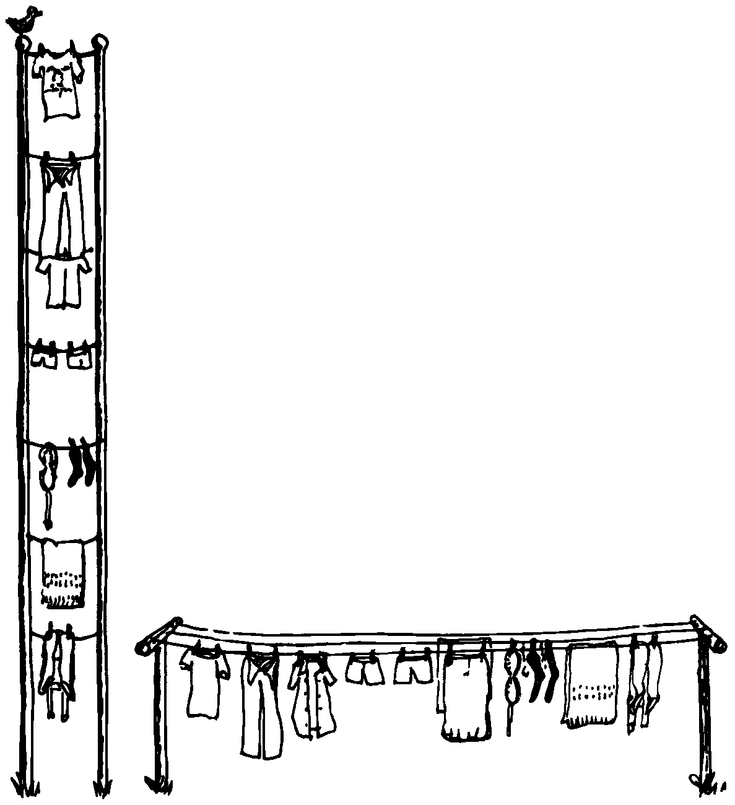

Defining the Data Structures
============================

After defining the interfaces, and sometimes defining the rules,
occasionally you’ll need to define certain data structures as well.
We’re not referring here to the implementation of the data structures,
but rather to a description of their conceptual model.

If you’re automating a library index, for instance, a crucial portion of
your analysis will concern developing the logical data structure. You’ll
have to decide what information will be kept for each book: title,
author, subject, etc. These “attributes” will comprise an “entity” (set
of related records) called . Then you’ll have to determine what other
data structures will be required to let the users search the
efficiently.

   the correct one is the simpler.
   

    the correct one is the simpler.

Certain constraints will also affect the conceptual model of the data
structure. In the library index example, you need to know not only
*what* information the users need, but also how long they’re willing to
*wait* to get it.

For instance, users can request listings of topics by year of
publication—say everything on ladies’ lingerie between 1900 and 1910. If
they expect to get this information in the snap of a girdle, you’ll have
to index on years and on topics. If they can wait a day, you might just
let the computer search through all the books in the library.
