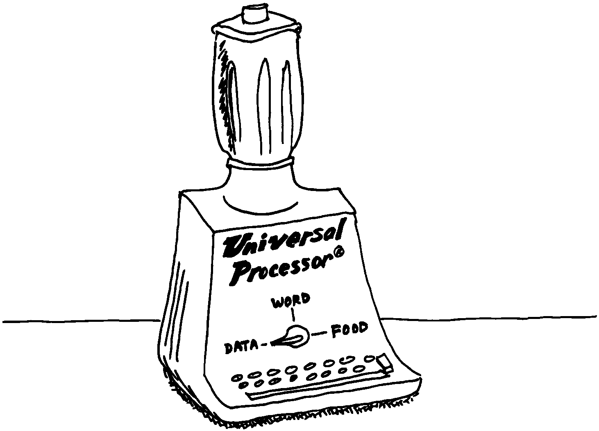

Achieving Simplicity
====================

Keep it simple.

While you are taking these crucial first steps toward understanding the
problem, keep in mind the old saying:

Given two solutions to a problem, the correct one is the simpler.

This is especially true in software design. The simpler solution is
often more difficult to discover, but once found, it is:

-  easier to understand

-  easier to implement

-  easier to verify and debug

-  easier to maintain

-  more compact

-  more efficient

-  more fun

One of the most compelling advocates of simplicity is :

You need a feeling for the size of the problem. How much code should it
take to implement the thing? One block? Three? I think this is a very
useful design tool. You want to gut-feel whether it’s a trivial problem
or a major problem, how much time and effort you should spend on it.

When you’re done, look back and say, “Did I come up with a solution that
is reasonable?” If your solution fills six screens, it may seem you’ve
used a sledgehammer to kill a mosquito. Your mental image is out of
proportion to the significance of the problem.

I’ve seen nuclear physics programs with hundreds of thousands of lines
of FORTRAN. Whatever that code does, it doesn’t warrant hundreds of
thousands of lines of code. Probably its writers have overgeneralized
the problem. They’ve solved a large problem of which their real needs
are a subset. They have violated the principle that the solution should
match the problem.

Generality usually involves complexity. Don’t generalize your solution
any more than will be required; instead, keep it changeable.

continues:

Given a problem, you can code a solution to it. Having done that, and
found certain unpleasantnesses to it, you can go back and change the
problem, and end up with a simpler solution.

There’s a class of device optimization—minimizing the number of gates in
a circuit-where you take advantage of the “don’t care” situation. These
occur either because a case won’t arise in practice or because you
really don’t care. But the spec is often written by people who have no
appreciation for programming. The designer may have carefully specified
all the cases, but hasn’t told you, the programmer, which cases are
really important.

If you are free to go back and argue with him and take advantage of the
“don’t cares,” you can come up with a simpler solution.

Take an engineering application, such as a 75-ton metal powder press,
stamping out things. They want to install a computer to control the
valves in place of the hydraulic control previously used. What kind of
spec will you get from the engineer? Most likely the sensors were placed
for convenience from an electromechanical standpoint. Now they could be
put somewhere else, but the engineer has forgotten. If you demand
explanations, you can come closer to the real world and further from
their model of the world.

Another example is the PID (proportional integration and
differentiation) algorithm for servos. You have one term that
integrates, another term that differentiates, and a third term that
smooths. You combine those with 30% integration, 10% differentiation, or
whatever. But it’s only a digital filter. It used to be convenient in
analog days to break out certain terms of the digital filter and say,
“This is the integrator and this is the differentiator. I’ll make this
with a capacitor and I’ll make that with an inductor.”

Again the spec writers will model the analog solution which was modeling
the electromechanical solution, and they’re several models away from
reality. In fact, you can replace it all with two or three coefficients
in a digital filter for a much cleaner, simpler and more efficient
solution.

Go back to what the problem was before the customer tried to solve it.
Exploit the “don’t cares.”

   
   An overgeneralized solution.

continues:

Sometimes the possibilities for simplification aren’t immediately
obvious.

There’s this problem of zooming in a digitized graphics display, such as
CAD systems. You have a picture on the screen and you want to zoom in on
a portion to see the details.

I used to implement it so that you move the cursor to the position of
interest, then press a button, and it zooms until you have a window of
the desired size. That was the way I’ve always done it. Until I realized
that that was stupid. I never needed to zoom with such fine resolution.

So instead of moving the cursor a pixel at a time, I jump the cursor by
units of, say, ten. And instead of increasing the size of box, I jump
the size of the box. You don’t have a choice of sizes. You zoom by a
factor of four. The in-between sizes are not interesting. You can do it
as many times as you like.

By quantizing things fairly brutally, you make it easier to work with,
more responsive, and simpler.

To simplify, quantize.

concludes:

It takes arrogance to go back and say “You didn’t really mean this,” or
“Would you mind if I took off this page and replaced it with this
expression?” They get annoyed. They want you to do what they told you to
do.

took this attitude when he redesigned Forth
:raw-latex:`\cite{stuart80}`. He didn’t like the input buffer, so he
implemented Forth without it, and discovered he didn’t really need an
input buffer.

If you can improve the problem, it’s a great situation to get into. It’s
much more fun redesigning the world than implementing it.

Effective programmers learn to be tactful and to couch their approaches
in non-threatening ways: “What would be the consequences of replacing
that with this?” etc.

Yet another way to simplify a problem is this:

To simplify, keep the user out of trouble.

Suppose you’re designing part of a word processor that displays a
directory of stored documents on the screen, one per line. You plan that
the user can move the cursor next to the name of any document, then type
a one-letter command indicating the chosen action: “p” for print, “e”
for edit, etc.

Initially it seems all right to let the user move the cursor anywhere on
the screen. This means that those places where text already appears must
be protected from being overwritten. This implies a concept of
“protected fields” and special handling. A simpler approach confines the
cursor to certain fields, possibly using reverse video to let the user
see the size of the allowable field.

Another example occurs when an application prompts the user for a
numeric value. You often see such applications that don’t check input
until you press “return,” at which time the system responds with an
error message such as “invalid number.” It’s just as easy—probably
easier—to check each key as it’s typed and simply not allow non-numeric
characters to appear.

To simplify, take advantage of what’s available.

, a Forth programmer in Long Island, New York, comments:

I always try to design the application on the most powerful processor I
can get my hands on. If I have a choice between doing development on a
68000-based system and a 6809-based system, I’d go for the 68000-based
system. The processor itself is so powerful it takes care of a lot of
details I might otherwise have to solve myself.

If I have to go back later and rewrite parts of the application for a
simpler processor, that’s okay. At least I won’t have wasted my time.

A word of caution: If you’re using an existing component to simplify
your prototype, don’t let the component affect your design. You don’t
want the design to depend on the internals of the component.
