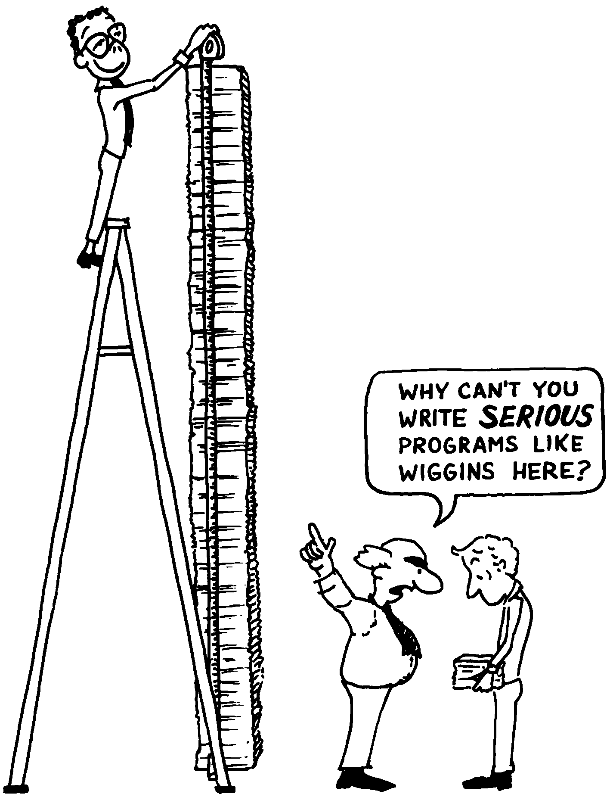

Budgeting and Scheduling
========================

Another important aspect of the analysis phase is figuring the price
tag. Again, this process is much more difficult than it would seem. If
you don’t know the problem till you solve it, how can you possibly know
how long it will take to solve it?

Careful planning is essential, because things always take longer than
you expect. I have a theory about this, based on the laws of
probability:

   
   Conventional wisdom reveres complexity.

The mean time for making a “two-hour” addition to an application is
approximately 12 hours.

Imagine the following scenario: You’re in the middle of writing a large
application when suddenly it strikes you to add some relatively simple
feature. You think it’ll take about two hours, so without further
planning, you just do it. Consider: That’s two hours coding time. The
design time you don’t count because you perceived the need—and the
design—in a flash of brilliance while working on the application. So you
estimate two hours.

But consider the following possibilities:

#. Your implementation has a bug. After two hours it doesn’t work. So
   you spend another two hours recoding. (Total 4.)

#. OR, before you implemented it, you realized your initial design
   wouldn’t work. You spend two hours redesigning. *These* two hours
   count. Plus another two hours coding it. (Total 4.)

#. OR, you implement the first design before you realize the design
   wouldn’t work. So you redesign (two more hours) and reimplement (two
   more). (Total 6.)

#. OR, you implement the first design, code it, find a bug, rewrite the
   code, find a design flaw, redesign, recode, find a bug in the new
   code, recode again. (Total 10.) You see how the thing snowballs?

#. Now you have to document your new feature. Add two hours to the
   above. (Total 12.)

#. After you’ve spent anywhere from 2 to 12 hours installing and
   debugging your new feature, you suddenly find that element Y of your
   application bombs out. Worst yet, you have no idea why. You spend two
   hours reading memory dumps trying to divine the reason. Once you do,
   you spend as many as 12 additional hours redesigning element Y.
   (Total 26.) Then you have to document the syntax change you made to
   element Y. (Total 27.)

That’s a total of over three man-days. If all these mishaps befell you
at once, you’d call for the men with the little white coats. It rarely
gets that bad, of course, but the odds are decidedly *against* any
project being as easy as you think it will be.

How can you improve your chances of judging time requirements correctly?
Many fine books have been written on this topic, notably *The Mythical
Man-Month* by , Jr. :raw-latex:`\cite{brooks75}`. I have little to add
to this body of knowledge except for some personal observations.

#. Don’t guess on a total. Break the problem up into the smallest
   possible pieces, then estimate the time for each piece. The sum of
   the pieces is always greater than what you’d have guessed the total
   would be. (The whole appears to be less than the sum of the parts.)

#. In itemizing the pieces, separate those you understand well enough to
   hazard a guess from those you don’t. For the second category, give
   the customer a range.

#. A bit of psychology: always give your client some options. Clients
   *like* options. If you say, “This will cost you $6,000,” the client
   will probably respond “I’d really like to spend $4,000.” This puts
   you in the position of either accepting or going without a job.

   But if you say, “You have a choice: for $4,000 I’ll make it *walk*
   through the hoop; for $6,000 I’ll make it *jump* through the hoop.
   For $8,000 I’ll make it *dance* through the hoop waving flags,
   tossing confetti and singing “Roll Out the Barrel.”

   Most customers opt for jumping through the hoop.

Everything takes longer than you think, including thinking.
