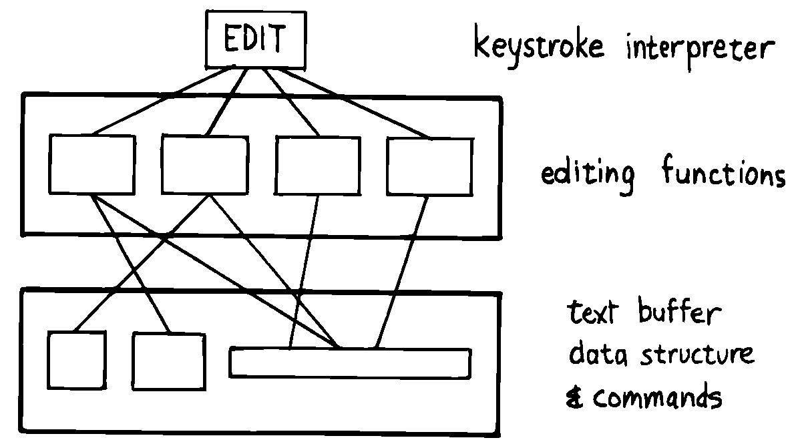

Example: A Tiny Editor
======================

Let’s apply decomposition by component to a real problem. It would be
nice to design a large application right here in , but alas, we don’t
have the room and besides, we’d get sidetracked in trying to understand
the application.

Instead, we’ll take a component from a large application that has
already been decomposed. We’ll design this component by decomposing it
further, into subcomponents.

Imagine that we must create a tiny editor that will allow users to
change the contents of input fields on their terminal screen. For
instance, the screen might look like this:

The editor will provide three modes for users to change the contents of
the input field:

Overwrite.
    Typing ordinary characters overwrites any characters that were there
    before.

Delete.
    Pressing the combination of keys “Ctrl D” deletes the character
    under the cursor and slides the remaining characters leftwards.

Insert.
    Pressing the combination of keys “Ctrl I” switches the editor into
    “Insert Mode,” where subsequently typing ordinary characters inserts
    them at the cursor position, sliding the remaining characters
    rightwards.

As part of the conceptual model we should also consider the error or
exception-handling; for instance, what is the limit of the field? what
happens in insert mode when characters spill off the right? etc.

That’s all the specification we have right now. The rest is up to us.

Let’s try to determine what components we’ll need. First, the editor
will react to keys that are typed at the keyboard. Therefore we’ll need
a keystroke interpreter—some kind of routine that awaits keystrokes and
matches them up with a list of possible operations. The keystroke
interpreter is one component, and its lexicon will consist of a single
word. Since that word will allow the editing of a field, let’s call the
word .

The operations invoked by the keystroke interpreter will comprise a
second lexicon. The definitions in this lexicon will perform the various
functions required. One word might be called , another , etc. Since each
of these commands will be invoked by the interpreter, each of them will
process a single keystroke.

Below these commands should lie a third component, the set of words that
implement the data structure to be edited.

   
   Generalized decomposition of the Tiny Editor problem.

Finally, we’ll need a component to display the field on the video
screen. For the sake of simplicity, let’s plan on creating one word
only, , to redisplay the entire field after each key is pressed.

: EDITOR BEGIN KEY REVISE REDISPLAY ... UNTIL ;

This approach separates revising the buffer from updating the display.
For now, we’ll only concentrate on revising the buffer.

Let’s look at each component separately and try to determine the words
each will need. We can begin by considering the events that must occur
within the three most important editing functions: overwriting,
deleting, and inserting. We might draw something like the following on
the back of an old pizza menu (we won’t pay much attention to
exception-handling in the present discussion):

To Overwrite:
    |  

    @p2.1in>p2.1in Store new character into byte pointer to by pointer.

    | Advance pointer (unless at end of field). &

To Delete:
    |  

    @p2.1in>p2.1in Copy leftwards, by one place, the string beginning
    one place to the right of the pointer.

    | Store a “blank” into the last position on the line. &

To Insert:
    |  

    @p2.1in>p2.1in Copy rightwards, by one place, the string beginning
    at the pointer. Store new character into byte pointed to by pointer.

    | Advance pointer (unless at end of field). &

We’ve just developed the algorithms for the problem at hand.

Our next step is to examine these three essential procedures, looking
for useful “names”—that is procedures or elements which can either:

#. possibly be reused, or

#. possibly change

We discover that all three procedures use something called a “pointer.”
We need two procedures:

#. to get the pointer (if the pointer itself is relative, this function
   will perform some computation).

#. to advance the pointer

   Wait, three procedures:

#. to move the pointer backwards

because we will want “cursor keys” to move the cursor forward and back
without editing changes.

These three operators will all refer to a physical pointer somewhere in
memory. Where it is kept and how (relative or absolute) should be hidden
within this component.

Let’s attempt to rewrite these algorithms in code:

: KEY# ( returns value of key last pressed ) ... ; : POSITION ( returns
address of character pointed-to) ; : FORWARD ( advance pointer, stopping
at last position) ; : BACKWARD ( decrement pointer, stopping at first
position) ; : OVERWRITE KEY# POSITION C! FORWARD ; : INSERT SLIDE>
OVERWRITE ; : DELETE SLIDE< BLANK-END ;

To copy the text leftwards and rightwards, we had to invent two new
names as we went along, and (pronounced “slide-backwards” and
“slide-forwards” respectively). Both of them will certainly use , but
they also must rely on an element we’ve deferred considering: a way to
“know” the length of the field. We can tackle that aspect when we get to
writing the third component. But look at what we found out already: we
can describe “Insert” as simply “”.

In other words, “Insert” actually *uses* “Overwrite” even though they
appear to exist on the same level (at least to a Structured Programmer).

Instead of probing deeper into the third component, let’s lay out what
we know about the first component, the key interpreter. First we must
solve the problem of “insert mode.” It turns out that “insert” is not
just something that happens when you press a certain key, as delete is.
Instead it is a *different way of interpreting* some of the possible
keystrokes.

For instance in “overwrite” mode, an ordinary character gets stored into
the current cursor position; but in “insert mode” the remainder of the
line must first be shifted right. And the backspace key works
differently when the editor is in Insert Mode as well.

Since there are two modes, “inserting” and “not-inserting,” the
keystroke interpreter must associate the keys with two possible sets of
named procedures.

We can write our keystroke interpreter as a decision table (worrying
about the implementation later):

| >l>l>l ** &\ **\ & **
| Ctrl-D & DELETE & INSERT-OFF
| Ctrl-I & INSERT-ON & INSERT-OFF
| backspace & BACKWARD & INSERT<
| left-arrow & BACKWARD & INSERT-OFF
| right-arrow & FORWARD & INSERT-OFF
| return & ESCAPE & INSERT-OFF
| any printable & OVERWRITE & INSERT

We’ve placed the possible types of keys in the left column, what they do
normally in the middle column, and what they do in “insert mode” in the
right column.

To implement what happens when “backspace” is pressed while in Insert
Mode, we add a new procedure:

: INSERT< BACKWARD SLIDE< ;

(move the cursor backwards on top of the last character typed, then
slide everything to the right leftward, covering the mistake).

This table seems to be the most logical expression of the problem at the
current level. We’ll save the implementation for later ().

Now we’ll demonstrate the tremendous value of this approach in terms of
maintainability. We’ll throw ourselves a curve—a major change of plans!
