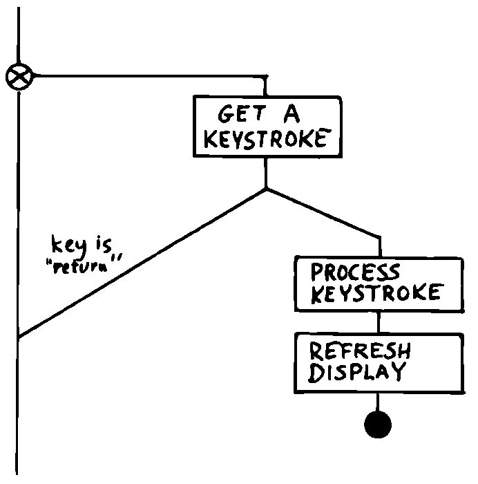
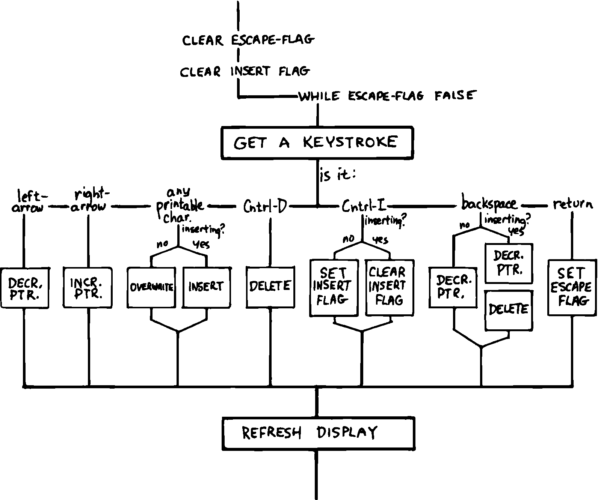
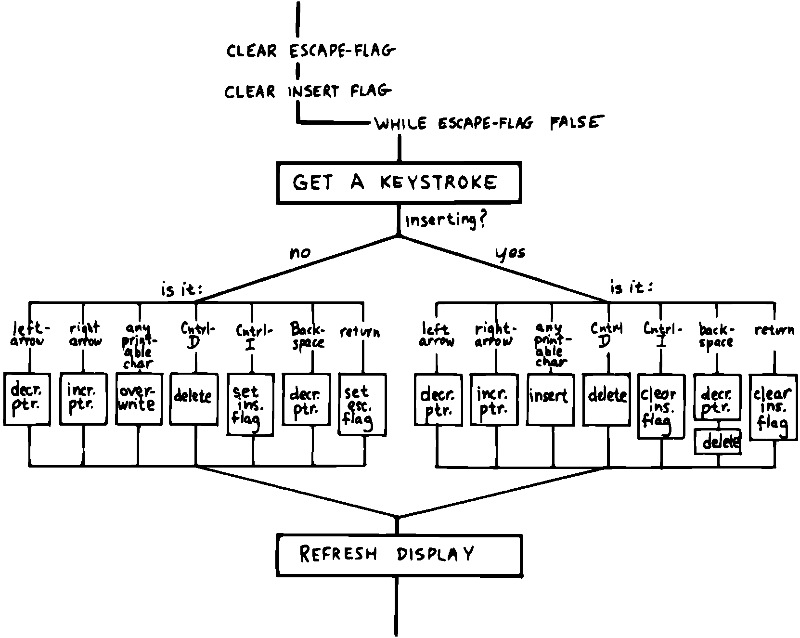
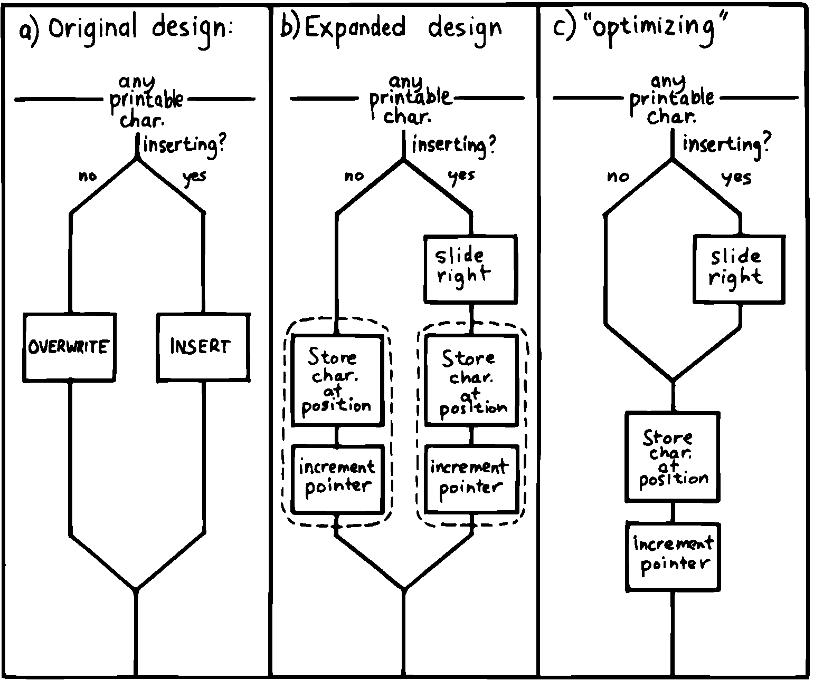
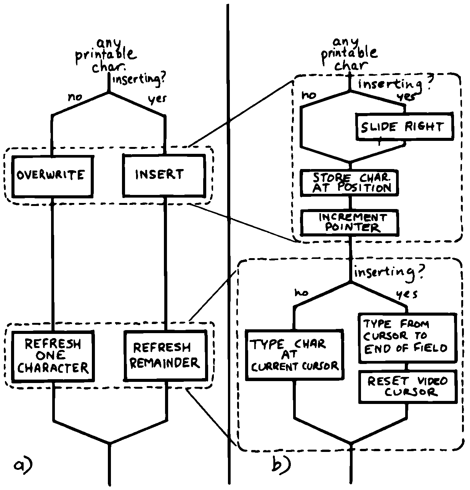

Designing and Maintaining a Traditional Application
===================================================

Let’s pretend we haven’t studied the Tiny Editor problem yet, and we’re
back with a minimal set of specs. We’ll also start with our initial
assumption, that we can refresh the display by retyping the entire field
after each keystroke.

According to the dictum of top-down design, let’s take the widest-angle
view possible and examine the problem. depicts the program in its
simplest terms. Here we’ve realized that the editor is actually a loop
which keeps getting keystrokes and performing some editing function,
until the user presses the return key.

   
   The traditional approach: view from the top.

Inside the loop we have three modules: getting a character from the
keyboard, editing the data, and finally refreshing the display to match
the data.

Clearly most of the work will go on inside “Process a Keystroke.”

Applying the notion of successive refinement, shows the editor problem
redrawn with “Process a Keystroke” expanded. We find it takes several
attempts before we arrive at this configuration. Designing this level
forces us to consider many things at once that we had deferred till
later in the previous try.

   
   A structure for ``Process a Keystroke.''

For instance, we must determine all the keys that might be pressed. More
significantly, we must consider the problem of “insert mode.” This
realization forces us to invent a flag called which gets toggled by the
“Ctrl I” key. It’s used within several of the structural lines to
determine how to process a type of key.

A second flag, called , seems to provide a nice structured way of
escaping the editor loop if the user presses the return key while not in
insert mode.

Having finished the diagram, we’re bothered by the multiple tests for
Insert Mode. Could we test for Insert Mode once, at the beginning?
Following this notion, we draw yet another chart ().

As you can see, this turns out even more awkward than the first figure.
Now we’re testing for each key twice. It’s interesting though, how the
two structures are totally different, yet functionally equivalent. It’s
enough to make one wonder whether the control structure is terribly
relevant to the problem.

   
   Another structure for ``Process a Keystroke.''

Having decided on the first structure, we’ve finally arrived at the most
important modules—the ones that do the work of overwriting, inserting,
and deleting. Take another look at our expansion of “Process a
Character” in . Let’s consider just one of the seven possible execution
paths, the one that happens if a printable character is pressed.

In (a) we see the original structural path for a printable character.

Once we figure out the algorithms for overwriting and inserting
characters, we might refine it as shown in (b). But look at that
embarrassing redundancy of code (circled portions). Most competent
structured programmers would recognize that this redundancy is
unnecessary, and change the structure as shown in (c). Not too bad so
far, right?

Change in Plan
--------------

Okay, everyone, now act surprised. We’ve just been told that this
application won’t run on a memory-mapped display. What does this change
do to our design structure?

   
   The same section, ``refined'' and ``optimized.''

Well, for one thing it destroys “Refresh Display” as a separate module.
The function of “Refresh Display” is now scattered among the various
structural lines inside “Process a Keystroke.” The structure of our
entire application has changed. It’s easy to see how we might have spent
weeks doing top-down design only to find we’d been barking down the
wrong tree.

What happens when we try to change the program? Let’s look again at the
path for any printable character.

(a) shows what happens to our first-pass design when we add refresh.
Part (b) shows our “optimized” design with the refresh modules expanded.
Notice that we’re now testing the Insert flag twice within this single
leg of the outer loop.

But worse, there’s a bug in this design. Can you find it?

In both cases, overwriting and inserting, the pointer is incremented
*before* the refresh. In the case of overwrite, we’re displaying the new
character in the wrong position. In the case of insert, we’re typing the
remainder of the line but not the new character.

Granted, this is an easy problem to fix. We need only move the refresh
modules up before “Increment Pointer.” The point here is: How did we
miss it? By getting preoccupied with control flow structure, a
superficial element of program design.

   
   Adding refresh.

In contrast, in our design by components the correct solution fell out
naturally because we “used” the refresh component inside the editing
component. Also we used inside .

By decomposing our application into components which use one another, we
achieved not only *elegance* but a more direct path to *correctness*.
