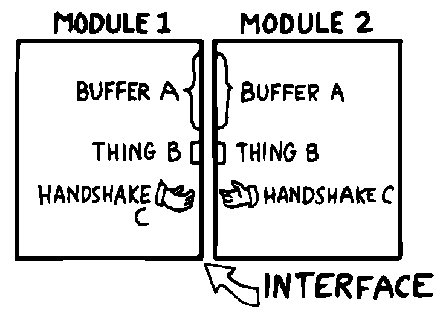
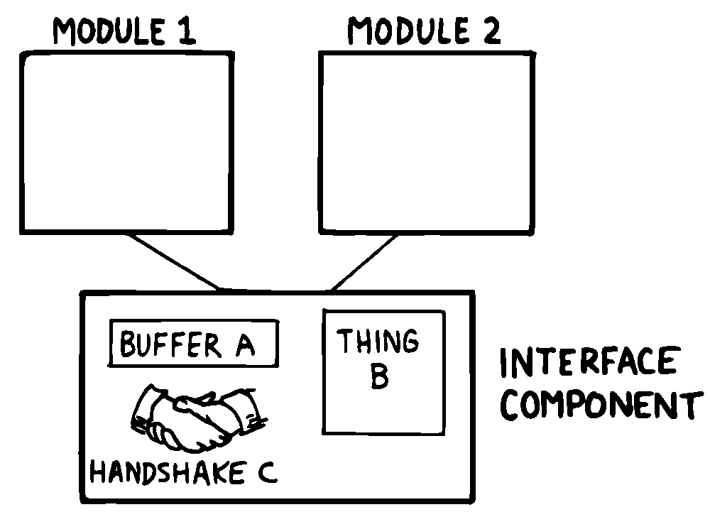

The Interface Component
=======================

In computer science terminology, interfacing between modules has two
aspects. First, there’s the way other modules invoke the module; this is
the control interface. Second, there’s the way other modules pass and
receive data to and from the module; this is the data interface.

Because of Forth’s dictionary structure, control is not an issue.
Definitions are invoked by being named. In this section, when we use the
term “interface” we’re referring to data.

When it comes to data interfaces between modules, traditional wisdom
says only that “interfaces should be carefully designed, with a minimum
of complexity.” The reason for the care, of course, is that each module
must implement its own end of the interface ().

This means the presence of redundant code. As we’ve seen, redundant code
brings at least two problems: bulky code and poor maintainability. A
change to the interface of one module will affect the interface of the
opposite module.

   
   Traditional view of the interface as a junction.

There’s more to good interface design than that. Allow me to introduce a
design element which I call the “interface component.” The purpose an
interface component is to implement, and *hide information about*, the
data interface between two or more other components ().

   
   Use of the interface component.

Both data structures and the commands involved in the communication of
data between modules should be localized in an interface component.

Let me give an example from my own recent experience. One of my hobbies
is writing text formatter/editors. (I’ve written two of them, including
the one on which I am writing this book.)

In my latest design the formatter portion contains two components. The
first component reads the source document and decides where to make line
and page breaks, etc. But instead of sending the text directly to the
terminal or printer, it saves up a line’s worth at a time in a “line
buffer.”

Similarly, instead of sending printer-control commands—for bold-facing,
underlining, etc.—as the text is being formatted, it defers these
commands until the text is actually sent. To defer the control commands,
I have a second buffer called the “attribute buffer.” It corresponds,
byte-for-byte, with the line buffer, except that each byte contains a
set of flags that indicate whether the corresponding character should be
underlined, boldfaced, or whatever.

The second component displays or prints the contents of the line buffer.
The component knows whether it is transmitting to the terminal or to the
printer, and outputs the text according to the attributes indicated by
the attribute buffer.

Here we have two well-defined components—the line-formatter and the
output component—each one shouldering part of the function of the
formatter as a whole.

The data interface between these two components is fairly complex. The
interface consists of two buffers, a variable that indicates the current
number of valid characters, and finally a “knowledge” of what all those
attribute patterns mean.

In Forth I’ve defined these elements together in a single screen. The
buffers are defined with , the count is an ordinary , and the attribute
patterns are defined as s, such as:

1 CONSTANT UNDERNESS ( bit mask for underlining) 2 CONSTANT BOLDNESS (
bit mask for boldface)

The formatting component uses phrases like to set bits in the attribute
buffer. The output component uses phrases like to read the attribute
buffer.

A Design Mistake
----------------

In designing an interface component, you should ask yourself “What is
the set of structures and commands that must be shared by the
communicating components?” It’s important to determine what elements
belong to the interface and what elements should remain within a single
component.

In writing my text formatter, I failed to answer this question fully and
found myself with a bug. The problem was this:

I allow different type widths to be used: condensed, double width, etc.
This means not only sending different signals to the printer, but
changing the number of characters allowed per line.

I keep a variable, called , for the formatter. indicates the right
margin: the point beyond which no more text can be set. Changing to a
different type width means changing the value of proportionately.
(Actually, this turns out to be a mistake in itself. I should be using a
finer unit of measurement, the number of which remains constant for the
line. Changing type widths would mean changing the number of units per
character. But getting back to the mistake at hand…)

Alas, I was also using inside the output component to determine how many
characters to display. My reasoning was that this value would change
depending on what type-width I was using.

I was right—99% of the time. But one day I discovered that, under a
certain condition, a line of condensed text was being somehow cut short.
The final couple of words were just missing. The reason turned out to be
that was getting changed before the output component had a chance to use
it.

Originally I had seen nothing wrong with letting the output component
blithely use the formatter’s as well. Now I realized that the formatter
had to leave a separate variable for the output component, to indicate
how many valid characters were in the buffers. This would leave any
subsequent font commands free to change .

It was important that the two buffers, the attribute commands, and the
new variable were the *only* elements that could be shared between the
two modules. Reaching into either module from the other one spells
trouble.

The moral of this story is that we must distinguish between data
structures that are validly used only within a single component and
those that may be shared by more than one component.

A related point:

Express in objective units any data to be shared by components.

For example:

-  Module A measures the temperature of the oven.

-  Module B controls the burner.

-  Module C makes sure the door is locked if the oven is too hot.

The information of global interest is the temperature of the oven,
expressed objectively in degrees. While Module A might receive a value
representing the voltage from a heat sensor, it should convert this
value to degrees before presenting it to the rest of the application.
