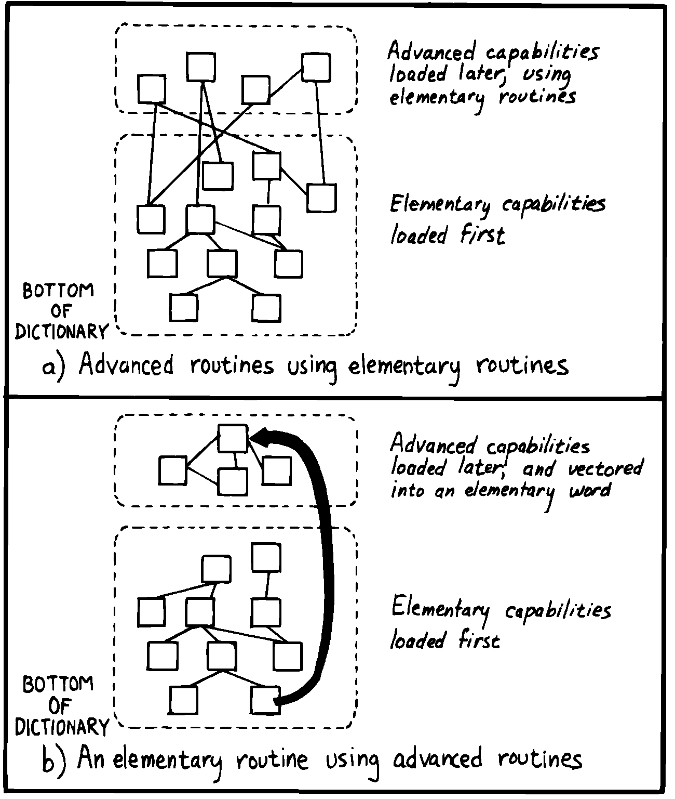

Decomposition by Sequential Complexity
======================================

We’ve been discussing one way to do decomposition: according to
components. The second way is according to sequential complexity.

One of Forth’s rules is that a word must already have been defined to be
invoked or referred to. Usually the sequence in which words are defined
parallels the order of increasing capabilities which the words must
possess. This sequence leads to a natural organization of the source
listing. The powerful commands are simply added on top of the elementary
application (a).

Like a textbook, the elementary stuff comes first. A newcomer to the
project would be able to read the elementary parts of the code before
moving on the advanced stuff.

   
   Two ways to add advanced capabilities.

But in many large applications, the extra capabilities are best
implemented as an enhancement to some private, root function in the
elementary part of the application (b). By being able to change the
root’s capability, the user can change the capability of all the
commands that use the root.

Returning to the word processor for an example, a fairly primitive
routine is the one that starts a new page. It’s used by the word that
starts a new line; when we run out of lines we must start a new page.
The word that starts a new line, in turn, is used by the routine that
formats words on the line; when the next word won’t fit on the current
line, we invoke . This “uses” hierarchy demands that we define early in
the application.

The problem? One of the advanced components includes a routine that must
be invoked by . Specifically, if a figure or table appears in the middle
of text, but at format time won’t fit on what’s left of the page, the
formatter defers the figure to the next page while continuing with the
text. This feature requires somehow “getting inside of” , so that when
is next executed, it will format the deferred figure at the top of the
new page:

: NEWPAGE ... ( terminate page with footer) ( start new page with
header) ... ?HOLDOVER ... ;

How can invoke , if is not defined until much later?

While it’s theoretically possible to organize the listing so that the
advanced capability is defined before the root function, that approach
is bad news for two reasons.

First, the natural organization (by degree of capability) is destroyed.
Second, the advanced routines often use code that is defined amid the
elementary capabilities. If you move the advanced routines to the front
of the application, you’ll also have to move any routines they use, or
duplicate the code. Very messy.

You can organize the listing by degree of complexity using a technique
called “vectoring.” You can allow the root function to invoke (point to)
any of various routines that have been defined after the root function
itself. In our example, only the *name* of the routine need be created
early; its definition can be given later.

treats the subject of vectoring in Forth.
