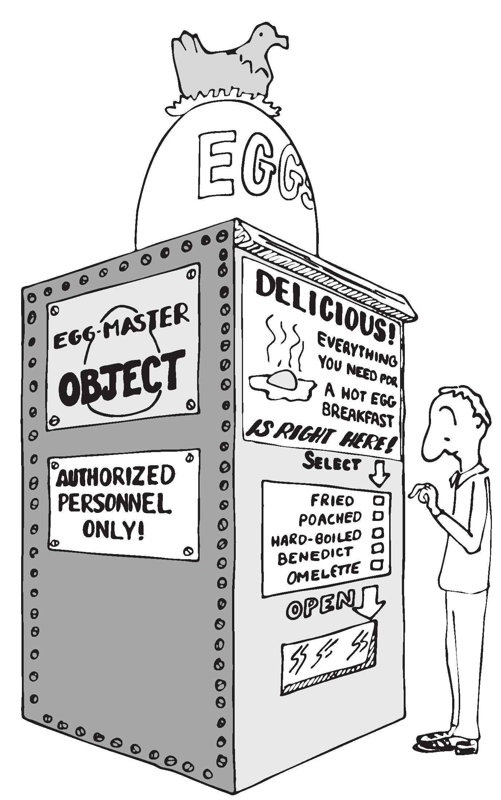

The Limits of Level Thinking
============================

Most of us are guilty of over-emphasizing the difference between
“high-level” and “low-level.” This notion is an arbitrary one. It limits
our ability to think clearly about software problems.

“Level” thinking, in the traditional sense, distorts our efforts in
three ways:

#. It implies that the order of development should follow a hierarchical
   structure

#. It implies that levels should be segregated from each other,
   prohibiting the benefits of reusability

#. It fosters syntactical differences between levels (e.g., assembler
   vs. “high-level” languages) and a belief that the nature of
   programming somehow changes as we move further from machine code.

Let’s examine each of these misconceptions one by one.

Where to Begin?
---------------

I asked how he would go about developing a particular application, a
game for children. As the child presses the digits on the numeric
keypad, from zero to nine, that same number of large boxes would appear
on the screen.

:

I don’t start at the top and work down. Given that exact problem, I
would write a word that draws a box. I’d start at the bottom, and I’d
end up with a word called , which monitored the keyboard.

How much of that is intuitive?

Perhaps some degree of it. I know where I’m going so I don’t have to
start there. But also it’s more fun to draw boxes than to program a
keyboard. I’ll do the thing that’s most fun in order to get into the
problem. If I have to clean up all those details later, that’s the price
I pay.

Are you advocating a “fun-down” approach?

Given that you’re doing it in a free-spirit fashion, yes. If we were
giving a demonstration to a customer in two days, I’d do it differently.
I would start with the most visible thing, not the most fun thing. But
still not in that hierarchical sequence, top down. I base my approach on
more immediate considerations such as impressing the customer, getting
something to work, or showing other people how it’s going to work to get
them interested.

If you define a level as “nesting,” then yes, it’s a good way to
decompose a problem. But I’ve never found the notion of “level” useful.
Another aspect of levels is languages, metalanguages,
meta-metalanguages. To try and split hairs as to which level you are
on—assembler level, first integration level, last integration level—it’s
just tedious and not helpful. My levels get all mixed up hopelessly.

Designing by components makes where you start less important. You could
start with the key interpreter, for instance. Its goal is to receive
keystrokes and convert them to numbers, passing these numbers to an
internally invoked word. If you substitute the Forth word (“dot,” which
prints a number from the stack), then we can implement the key
interpreter, test it, and debug it without using routines that have
anything to do with drawing squares. On the other hand, if the
application required hardware support (such as a graphics package) that
we didn’t have on hand, we might want to substitute something available,
such as displaying an asterisk, just to get into the problem. Thinking
in terms of lexicons is like painting a huge mural that spans several
canvases. You work on all the canvases at once, first sketching in the
key design elements, then adding splashes of color here and there… until
the entire wall is complete.

In deciding where to start designing, look for:

-  areas where the most creativity is required (the areas where change
   is most likely)

-  areas that give the most satisfying feedback (get the juices flowing)

-  areas in which the approach decided upon will greatly affect other
   areas, or which will determine whether the stated problem can be
   solved at all

-  things you should show the customer, for mutual understanding

-  things you can show the investors, if necessary for the rent.

No Segregation Without Representation
-------------------------------------

The second way in which levels can interfere with optimal solutions is
by encouraging segregation of the levels. A popular design construct
called the “object” typifies this dangerous philosophy. [1]_

An object is a portion of code that can be invoked by a single name, but
that can perform more than one function. To select a particular function
you have to invoke the object and pass it a parameter or a group of
parameters. You can visualize the parameters as representing a row of
buttons you can push to make the object do what you want.

The benefit of designing an application in terms of objects is that,
like a component, the object hides information from the rest of the
application, making revision easier.

There are several problems, though. First, the object must contain a
complicated decision structure to determine which function it must
perform. This increases object size and decreases performance. A
lexicon, on the other hand, provides all usable functions by name for
you to invoke directly.

Second, the object is usually designed to stand alone. It can’t take
advantage of tools provided by supporting components. As a result, it
tends to duplicate code inside itself that will appear elsewhere in the
application. Some objects are even required to parse text in order to
interpret their parameters. Each may even use its own syntax. A
shameless waste of time and energy!

   
   ``No scrambled?''

Finally, because the object is constructed to recognize a finite set of
possibilities, it’s difficult to make additions to the row of buttons
when a new function is needed. The tools inside the object have not been
designed for reuse.

The idea of levels pervades the design of the IBM Personal Computer.
Besides the processor itself (with its own machine instruction set, of
course), there are these software levels:

-  the set of utilities written in assembler and burned into the
   system’s ROM

-  the disk operating system, which invokes the utilities

-  the high-level language of choice, which invokes the operating system
   and the utilities

-  and finally, any application using the language.

The ROM utilities provide the hardware-dependent routines: those that
handle the video screen, disk drives, and keyboard. You invoke them by
placing a control code in a certain register and generating the
appropriate software interrupt.

For instance, software interrupt causes entry to the video routines.
There are 16 of these routines. You load register with the number of the
video routine you want.

Unfortunately, in all 16 routines there is not one that displays a text
string. To do that, you must repeat the process of loading registers and
generating a software interrupt, which in turn must make a decision
about which routine you want, and do a few other things you don’t
need—for *every single character*.

Try writing a text editor in which the entire screen may need to be
refreshed with each keystroke. Slow as mail! You can’t improve the speed
because you can’t reuse any of the information within the video routines
except for what’s provided on the outside. The stated reason for this is
to “insulate” the programmer from device addresses and other details of
the hardware. After all, these could change with future upgrades.

The only way to efficiently implement video I/O on this machine is to
move strings directly into video memory. You can do this easily, because
the reference manual tells you the address at which video memory starts.
But this defeats the intent of the system’s designers. Your code may no
longer survive a hardware revision.

By supposedly “protecting” the programmer from details, segregation has
defeated the purpose of information hiding. Components, in contrast, are
not segregated modules but rather cumulative additions to the
dictionary. A video lexicon would, at the very least, give a name for
the address of video memory.

It’s not that anything’s wrong with the concept of a bit-switch function
interface between components, when it’s necessary. The problem here is
that this video component was incompletely designed. On the other hand,
if the system had been fully integrated—operating system and drivers
written in Forth—the video component would not *have* to be designed to
suit all needs. An application programmer could either rewrite the
driver or write an extension to the driver using available tools from
the video lexicon.

Don’t bury your tools.

The Tower of Babble
-------------------

The final deception perpetrated by level thinking is that programming
languages should become qualitatively different the “higher” you go. We
tend to speak of high-level code as something rarefied, and low-level
code as something grubby and profane.

To some degree these distinctions have validity, but this is only the
result of certain arbitrary architectural constraints that we all accept
as the norm. We’ve grown accustomed to assemblers with terse mnemonics
and unnatural syntactical rules, because they’re “low-level.”

The component concept rebels against the polarity of high-level vs.
low-level. All code should look and feel the same. A component is simply
a set of commands that together transform data structures and algorithms
into useful functions. These functions can be used without knowledge of
the structures and/or algorithms within.

The distance of these structures from actual machine code is irrelevant.
The code written to toggle bits in an output port should, in theory,
look no more intimidating than the code to format a report.

Even machine code should be readable. A true Forth-based engine would
enjoy a syntax and dictionary identical and continuous with the
“high-level” dictionary we know today.

.. [1]
   Editor’s note: But see the recant in the 1994 Preface on page , and
   the clairification in the 2004 Preface on page . Think of something
   like Windows COM “objects” or CORBA.

   Real object oriented programming, as it originates in Smalltalk, does
   not hide information from the programmer. Adding a “scrambled” method
   to the “egg master object” is no problem. Smalltalk works by adding
   methods to known classes, you don’t even need to subclass them. You
   can look inside an object and its source code whenever you want. And
   table driven method dispatching can be quite efficient.
