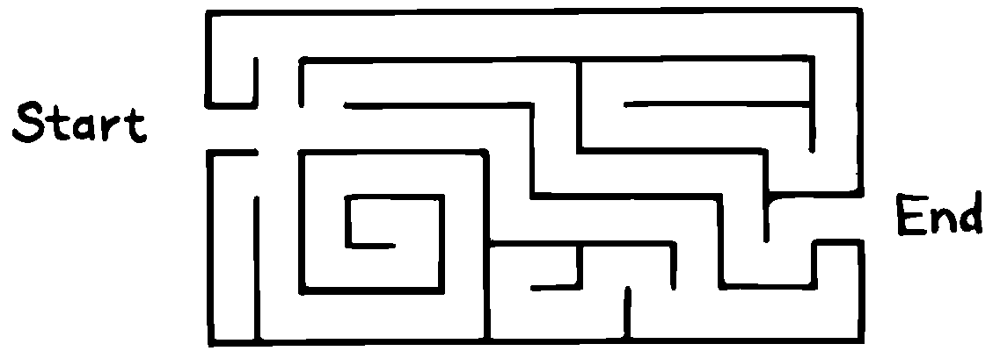
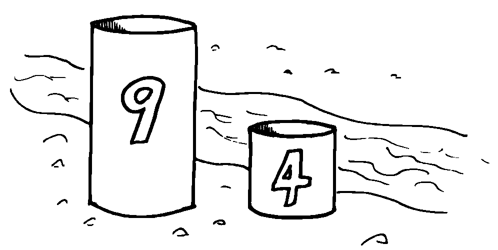
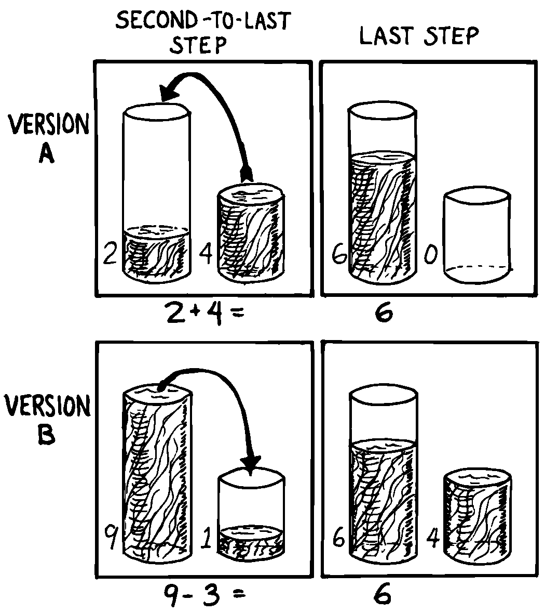
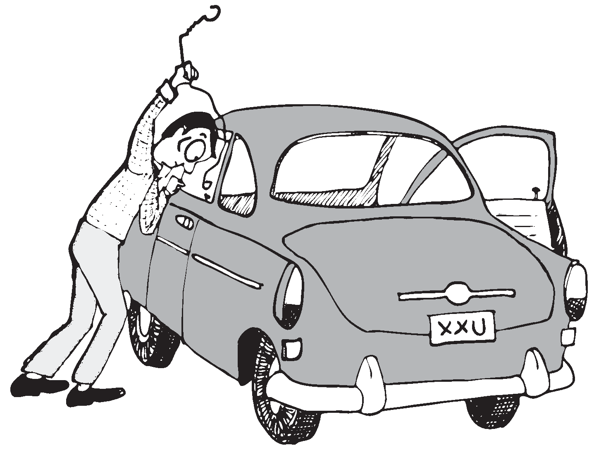
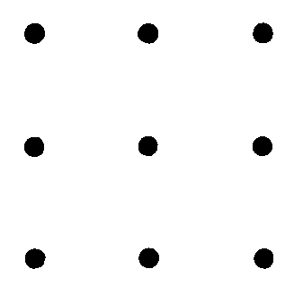
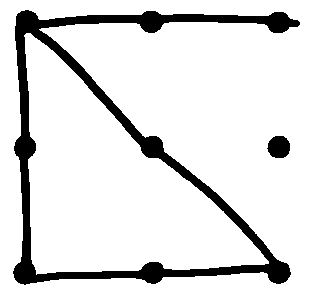
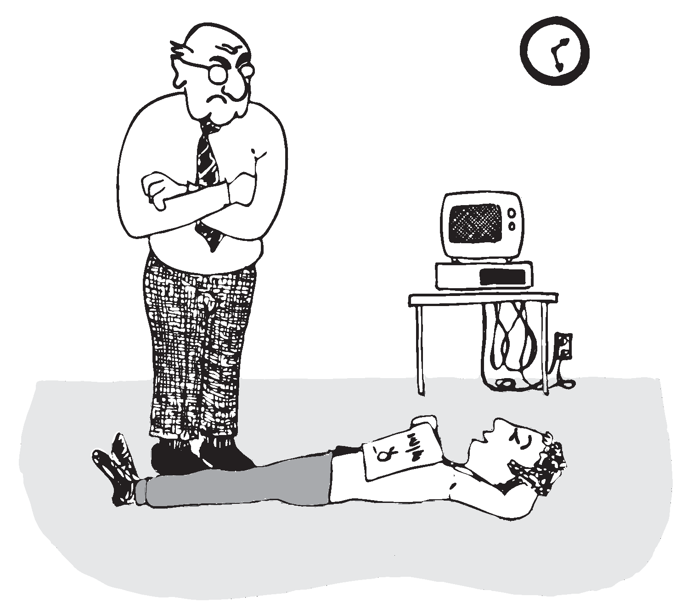

Problem-Solving Techniques
==========================

Even neophytes can solve programming problems without devoting any
conscious thought to problem solving techniques. So what’s the point in
studying techniques of problem solving? To quicken the process. By
thinking about the *ways* in which we solve problems, apart from the
problems themselves, we enrich our subconscious storehouse of
techniques.

has written several books on problem solving, especially of the
mathematical problem. The most accessible of these is *How to Solve It*
:raw-latex:`\cite{polya}`. Although solving a mathematical problem isn’t
quite the same as solving a software problem, you’ll find some valuable
suggestions there.

The following series of tips summarize several techniques recommended by
the science of problem solving:

Determine your goal.

Know what you’re trying to accomplish. As we saw in , this step can be
detailed further:

Determine the data interfaces: Know what data will be required to
accomplish the goal, and make sure those data are available (input).
Know what data the function is expected to produce (output). For a
single definition, this means writing the stack-effect comment.

Determine the rules; review all the facts that you know. In Chapter Two
we described the rates for computing the cost of a phone call along with
the rules for applying the rates.

Picture the problem as a whole.

In the *analysis* phase we separated the problem into its parts, to
clarify our understanding of each piece. We are now entering the
*synthesis* phase. We must visualize the problem as a whole.

Try to retain as much information about the problem in your mind as
possible. Use words, phrases, figures and tables, or any kind of graphic
representation of the data and/or rules to help you see the maximum
information at a glance. Fill your mind to bursting with the
requirements of the problem you need to solve, the way you might fill
your lungs with air.

Now hold that mental image, the way you might hold your breath.

One of two things will happen:

You may see the solution in a flash of insight. Great! Exhale a sigh of
relief and proceed directly to implementation. Or…, the problem is too
complex or too unfamiliar to be solved so easily. In this case, you’ll
have to turn your attention to analogies and partial solutions. As you
do so, it’s important that you have already concentrated on the
problem’s requirements all at once, engraving these requirements on your
mental retina.

Develop a plan.

If the solution didn’t come at a glance, the next step is to determine
the approach that you will take to solve it. Set a course for action and
avoid the trap of fumbling about aimlessly.

The following tips suggest several approaches you might consider.

Think of an analogous problem.

Does this problem sound familiar? Have you written a definition like it
before? Figure out what parts of the problem are familiar, and in what
ways this problem might differ. Try to remember how you solved it
before, or how you solved something like it.

Work forward.

The normal, obvious way to attack a problem is by beginning with the
known, and proceeding to the unknown. In deciding which horse to bet on,
you’d begin with their recent histories, their current health, and so
on, apply weights to these various factors and arrive at a favorite.

Work backward.

More complicated problems present many possible ways to go with the
incoming data. How do you know which route will take you closer to the
solution? You don’t. This class of problem is best solved by working
backward ().

   forward.
   

    forward.

Believe.

Belief is a necessary ingredient for successfully working backward.
We’ll illustrate with a famous mathematical problem. Suppose we have two
containers. The containers have no graduation marks, but one holds nine
gallons and the other holds four gallons. Our task is to measure out
exactly six gallons of water from the nearby stream in one of the
containers ().

   
   Two containers.

Try to solve this on your own before reading further.

How can we get a “six” out of a “nine” and a “four”? We can start out
working forward, by mentally transferring water from one container to
the other. For example, if we fill the large container twice from the
small container, we’ll get eight gallons. If we fill the nine-gallon
container to the brim, then empty enough water to fill the four-gallon
container, we’ll have exactly five gallons in the large container.

These ideas are interesting, but they haven’t gotten us six gallons. And
it’s not clear how they will get us six gallons.

Let’s try working backward. We assume we’ve measured six gallons of
water, and it’s sitting in the large container (it won’t fit in the
small one!). Now, how did we get it there? What was the state of our
containers one step previously?

There are only two possibilities ():

#. The four-gallon container was full, and we just added it to the large
   container. This implies that we already had two gallons in the large
   container. Or…

#. The nine-gallon container was full, and we just poured off three
   gallons into the small container.

Which choice? Let’s make a guess. The first choice requires a two-gallon
measurement, the second requires a three-gallon measurement. In our
initial playing around, we never saw a unit like two. But we did see a
difference of one, and one from four is three. Let’s go with version b.

Now comes the real trick. We must make ourselves *believe* without doubt
that we have arrived at the situation described. We have just poured off
three gallons into the small container. Suspending all disbelief, we
concentrate on how we did it.

How can we pour off three gallons into the small container? If there had
already been one gallon in the small container! Suddenly we’re over the
hump. The simple question now is, how do we get one gallon in the small
container? We must have started with a full nine-gallon container,
poured off four gallons twice, leaving one gallon. Then we transferred
the one gallon to the small container.

   
   Achieving the end result.

   
   Intent on a complicated problem.

Our final step should be to check our logic by running the problem
forwards again.

Here’s another benefit of working backward: If the problem is
unsolvable, working backward helps you quickly prove that it has no
solution.

Recognize the auxiliary problem.

Before we’ve solved a problem, we have only a hazy notion of what
steps—or even how many steps—may be required. As we become more familiar
with the problem, we begin to recognize that our problem includes one or
more subproblems that somehow seem different from the main outline of
the proposed procedure.

In the problem we just solved, we recognized two subproblems: filling
the small container with one gallon and then filling the large container
with six gallons.

Recognizing these smaller problems, sometimes called “auxiliary
problems,” is an important problem-solving technique. By identifying the
subproblem, we can assume it has a straightforward solution. Without
stopping to determine what that solution might be, we forge ahead with
our main problem.

(Forth is ideally suited to this technique, as we’ll see.)

Step back from the problem.

It’s easy to get so emotionally attached to one particular solution that
we forget to keep an open mind.

The literature of problem solving often employs the example of the nine
dots. It stumped me, so I’ll pass it along. We have nine dots arranged
as shown in . The object is to draw straight lines that touch or pass
through all nine dots, without lifting the pen off the paper. The
constraint is that you must touch all nine dots with only four lines.

   
   The nine dots problem.

You can sit a good while and do no better than the almost-right . If you
concentrate really hard, you may eventually conclude that the problem is
a trick—there’s no solution.

   
   Not quite right.

But if you sit back and ask yourself,

“Am I cheating myself out a useful tack by being narrow-minded? Am I
assuming any constraints not specified in the problem? What constraints
might they be?”

then you might think of extending some of the lines beyond the perimeter
of the nine dots.

Use whole-brain thinking.

When a problem has you stumped and you seem to be getting nowhere,
relax, stop worrying about it, perhaps even forget about it for a while.

Creative people have always noted that their best ideas seem to come out
of the blue, in bed or in the shower. Many books on problem solving
suggest relying on the subconscious for the really difficult problems.

Contemporary theories on brain functions explore the differences between
rational, conscious thought (which relies on the manipulation of
symbols) and subconscious thought (which correlates perceptions to
previously stored information, recombining and relinking knowledge in
new and useful ways).

:raw-latex:`\cite{hart75}` explains the difficulty of solving a large
problem by means of logic:

A huge load is placed on that one small function of the brain that can
be brought into the attention zone for a period. The feat is possible,
like the circus act, but it seems more sensible to… use the full
resources of our glorious neocortex… the multibillion-neuron capacity of
the brain.

… The work aspect lies in providing the brain with raw input, as in
observing, reading, collecting data, and reviewing what others have
achieved. Once in, [subconscious] procedures take over, simultaneously,
automatically, outside of the attention zone.

… It seems apparent… that a search is going on during the interval,
though not necessarily continuously, much as in a large computer. I
would hazard the guess that the search ramifies, starts and stops,
reaches dead ends and begins afresh, and eventually assembles an answer
that is evaluated and then popped into conscious attention—often in
astonishingly full-blown detail.

Evaluate your solution. Look for other solutions.

You may have found one way of skinning the cat. There may be other ways,
and some of them may be better.

Don’t invest too much effort in your first solution without asking
yourself for a second opinion.

   
   ``I'm not just sleeping. I'm using my neocortex.''

