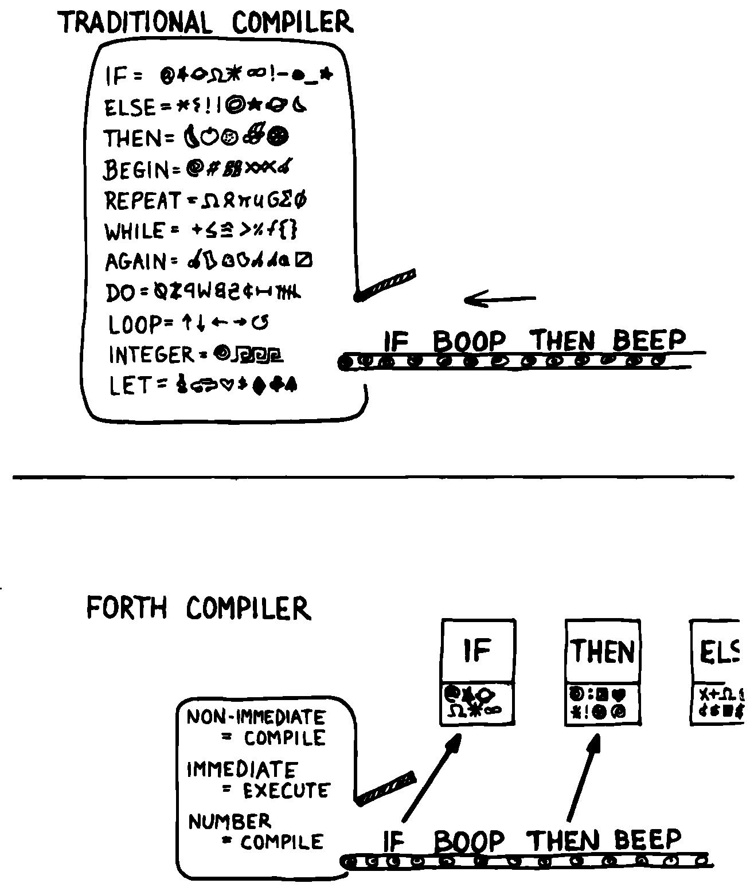

Forth Syntax
============

At this point in the development cycle you must decide how the words in
your new lexicon will be used in context. In doing so, keep in mind how
the lexicon will be used by subsequent components.

In designing a component, the goal is to create a lexicon that will make
your later code readable and easy to maintain.

Each component should be designed with components that use it in mind.
You must design the syntax of the lexicon so that the words make sense
when they appear in context. Hiding interrelated information within the
component will ensure maintainability, as we’ve seen.

At the same time, observe Forth’s own syntax. Rather than insisting on a
certain syntax because it seems familiar, you may save yourself from
writing a lot of unnecessary code by choosing a syntax that Forth can
support without any special effort on your part.

Here are some elementary rules of Forth’s natural syntax:

Let numbers precede names.

Words that require a numeric argument will naturally expect to find that
number on the stack. Syntactically speaking, then, the number should
precede the name. For instance, the syntax of the word , which emits
“:math:`n`” number of spaces, is

20 SPACES

Sometimes this rule violates the order that our ear is accustomed to
hearing. For instance, the Forth word expects to be preceded by both
arguments, as in

3 4 +

This ordering, in which values precede operators, is called “postfix.”

Forth, in its magnanimity, won’t *insist* upon postfix notation. You
could redefine to expect one number in the input stream, like this:

3 + 4

by defining it so:

: + BL WORD NUMBER DROP + ;

(where is 79/83 Standard, returning an address, and returns a
double-length value as in the 83 Standard Uncontrolled Reference Words).

Fine. But you wouldn’t be able to use this definition inside other colon
definitions or pass it arguments, thereby defeating one of Forth’s major
advantages.

Frequently, “noun” type words pass their addresses (or any type of
pointer) as a stack argument to “verb” type words. The Forth-like syntax
of

    “noun” “verb”

   
   img4-110

will generally prove easiest to implement because of the stack.

In some cases this word order sounds unnatural. For instance, suppose we
have a file named . One thing we can do with that file is it; that is,
format the information in pretty columns. If passes a pointer to , which
acts upon it, the syntax becomes

INVENTORY SHOW

If your spec demands the English word-order, Forth offers ways to
achieve it. But most involve new levels of complexity. Sometimes the
best thing to do is to choose a better name. How about

INVENTORY REPORT

(We’ve made the “pointer” an adjective, and the “actor” a noun.)

If the requirements insist on the syntax

SHOW INVENTORY

we have several options. might set a flag and would act according to the
flag. Such an approach has certain disadvantages, especially that must
be “smart” enough to know all the possible actions that might be taken
on it. (We’ll treat these problems in Chapters [chapter-7] and
[chapter-8].)

Or, might look ahead at the next word in the input stream. We’ll discuss
this approach in a tip, “Avoid expectations,” later in this chapter.

Or, the recommended approach, might set an “execution variable” that
will then execute. (We’ll discuss vectored execution in .)

Let text follow names.

If the Forth interpreter finds a string of text that is neither a number
nor a predefined word, it will abort with an error message. For this
reason, an undefined string must be preceded by a defined word.

An example is (dot-quote), which precedes the text it will later print.
Another example is (as well as all defining words), which precedes the
name that is, at the moment, still undefined.

The rule also applies to defined words that you want to refer to, but
not execute in the usual way. An example is , as in

FORGET TASK

Syntactically, must precede so that doesn’t execute.

Let definitions consume their arguments.

This syntax rule is more a convention of good Forth programming than a
preference of Forth.

Suppose you’re writing the word , which requires the number of a launch
pad and fires the appropriate rocket. You want the definition to look
roughly like this:

: LAUNCH ( pad#) LOAD AIM FIRE ;

Each of the three internal definitions will require the same argument,
the launch pad number. You’ll need two s somewhere. The question is
where? If you put them inside and , then you can keep them out of , as
in the definition above. If you leave them out of and , you’ll have to
define:

: LAUNCH ( pad#) DUP LOAD DUP AIM FIRE ;

By convention, the latter version is preferable, because and are
cleaner. They do what you expect them to do. Should you have to define ,
you can do it so:

: READY ( pad#) DUP LOAD AIM ;

and not

: READY ( pad#) LOAD AIM DROP ;

Use zero-relative numbering.

By habit we humans number things starting with one: “first, second,
third,” etc. Mathematical models, on the other hand, work more naturally
when starting with zero. Since computers are numeric processors,
software becomes easier to write when we use zero-relative numbering.

To illustrate, suppose we have a table of eight-byte records. The first
record occupies the first eight bytes of the table. To compute its
starting address, we add “0” to . To compute the starting address of the
“second” record, we add “8” to .

   
   A table of 8-byte records.

It’s easy to derive a formula to achieve these results:

+----------------------------+------------------------------------+------+
| first record starts at:    | :math:`\mathsf{0 \times 8} = {}`   | 0    |
+----------------------------+------------------------------------+------+
| second record starts at:   | :math:`\mathsf{1 \times 8} = {}`   | 8    |
+----------------------------+------------------------------------+------+
| third record starts at:    | :math:`\mathsf{2 \times 8} = {}`   | 16   |
+----------------------------+------------------------------------+------+

We can easily write a word which converts a record# into the address
where that record begins:

: RECORD ( record# – adr ) 8 \* TABLE + ;

Thus in computer terms it makes sense to call the “first record” the 0th
record.

If your requirements demand that numbering start at one, that’s fine.
Use zero-relative numbering throughout your design and then, only in the
“user lexicons” (the set of words that the end-user will use) include
the conversion from zero-to one-relative numbering:

: ITEM ( n – adr) 1- RECORD ;

Let addresses precede counts.

Again, this is a convention, not a requirement of Forth, but such
conventions are essential for readable code. You’ll find examples of
this rule in the words , , and .

Let sources precede destinations.

Another convention for readability. For instance, in some systems, the
phrase

22 37 COPY

copies Screen 22 to Screen 37. The syntax of incorporates both this
convention and the previous convention:

source destination count &poorbfCMOVE

Avoid expectations (in the input stream).

Generally try to avoid creating words that presume there will be other
words in the input stream.

Suppose your color computer represents blue with the value 1, and
light-blue with 9. You want to define two words: will return 1; may
precede to produce 9.

In Forth, it would be possible to define as a constant, so that when
executed it always returns 1.

1 CONSTANT BLUE

And then define such that it looks for the next word in the input
stream, executes it, and “ors” it with 8 (the logic of this will become
apparent when we visit this example again, later in the book):

: LIGHT ( precedes a color) ( – color value) ’ EXECUTE 8 OR ;

(in fig-Forth:

: LIGHT [COMPILE] ’ CFA EXECUTE 8 OR ;&textrm)

(For novices: The apostrophe in the definition of is a Forth word called
“tick.” Tick is a dictionary-search word; it takes a name and looks it
up in the dictionary, returning the address where the definition
resides. Used in this definition, it will find the address of the word
following —for instance, —and pass this address to the word , which will
execute , pushing a one onto the stack. Having “sucked up” the operation
of , now “or”s an 8 into the 1, producing a 9.)

This definition will work when invoked in the input stream, but special
handling is required if we want to let be invoked within a colon
definition, as in:

: EDITING LIGHT BLUE BORDER ;

Even in the input stream, the use of here will cause a crash if is
accidentally followed by something other than a defined word.

The preferred technique, if you’re forced to use this particular syntax,
is to have set a flag, and have determine whether that flag was set, as
we’ll see later on.

There will be times when looking ahead in the input stream is desirable,
even necessary. (The proposed solution is often implemented this way
:raw-latex:`\cite{rosen82}`.)

But generally, avoid expectations. You’re setting yourself up for
disappointment.

Let commands perform themselves.

This rule is a corollary to “Avoid expectations.” It’s one of Forth’s
philosophical quirks to let words do their own work. Witness the Forth
compiler (the function that compiles colon definitions), caricatured in
. It has very few rules:

   
   The traditional compiler vs. the {Forth}{} compiler.

-  Scan for the next word in the input stream and look it up in the
   dictionary.

-  If it’s an ordinary word, *compile* its address.

-  If it’s an “immediate” word, *execute* it.

-  If it’s not a defined word, try to convert it to a number and compile
   it as a literal.

-  If it’s not a number, abort with an error message.

Nothing is mentioned about compiling-words such as , , , etc. The colon
compiler doesn’t know about these words. It merely recognizes certain
words as “immediate” and executes them, letting them do their own work.
(See *Starting Forth*, Chapter Eleven, “How to Control the Colon
Compiler.”)

The compiler doesn’t even “look for” semicolon to know when to stop
compiling. Instead it *executes* semicolon, allowing it to do the work
of ending the definition and shutting off the compiler.

There are two tremendous advantages to this approach. First, the
compiler is so simple it can be written in a few lines of code. Second,
there’s no limit on the number of compiling words you can add at any
time, simply by making them immediate. Thus, even Forth’s colon compiler
is extensible!

Forth’s text interpreter and Forth’s address interpreter also adhere to
this same rule.

The following tip is perhaps the most important in this chapter:

Don’t write your own interpreter/compiler when you can use Forth’s.

One class of applications answers a need for a special purpose
language—a self-contained set of commands for doing one particular
thing. An example is a machine-code assembler. Here you have a large
group of commands, the mnemonics, with which you can describe the
instructions you want assembled. Here again, Forth takes a radical
departure from mainstream philosophy.

Traditional assemblers are special-purpose interpreters—that is, they
are complicated programs that scan the assembly-language listing looking
for recognized mnemonics such as , , , etc., and assemble machine
instructions correspondingly. The Forth assembler, however, is merely a
lexicon of Forth words that themselves assemble machine instructions.

There are many more examples of the special purpose language, each
specific to individual applications. For instance:

#. If you’re building an Adventure-type game, you’d want to write a
   language that lets you create and describe monsters and rooms, etc.
   You might create a defining word called to be used like this:

   ROOM DUNGEON

   Then create a set of words to describe the room’s attributes by
   building unseen data structures associated with the room:

   EAST-OF DRAGON-LAIR WEST-OF BRIDGE CONTAINING POT-O-GOLD etc.

   The commands of this game-building language can simply be Forth
   words, with Forth as the interpreter.

#. If you’re working with Programmable Array Logic (PAL) devices, you’d
   like a form of notation that lets you describe the behavior of the
   output pins in logical terms, based on the states of the input pins.
   A PAL programmer was written with wonderful simplicity in Forth by
   :raw-latex:`\cite{stolowitz82}`.

#. If you must create a series of user menus to drive your application,
   you might want to first develop a menu-compiling language. The words
   of this new language allow an application programmer to quickly
   program the needed menus—while hiding information about how to draw
   borders, move the cursor, etc.

All of these examples can be coded in Forth as lexicons, using the
normal Forth interpreter, without having to write a special-purpose
interpreter or compiler.

:

A simple solution is one that does not obscure the problem with
irrelevancies. It’s conceivable that something about the problem
requires a unique interpreter. But every time you see a unique
interpreter, it implies that there is something particularly awkward
about the problem. And that is almost never the case.

If you write your own interpreter, the interpreter is almost certainly
the most complex, elaborate part of your entire application. You have
switched from solving a problem to writing an interpreter.

I think that programmers like to write interpreters. They like to do
these elaborate difficult things. But there comes a time when the world
is going to have to quit programming keypads and converting numbers to
binary, and start solving problems.
