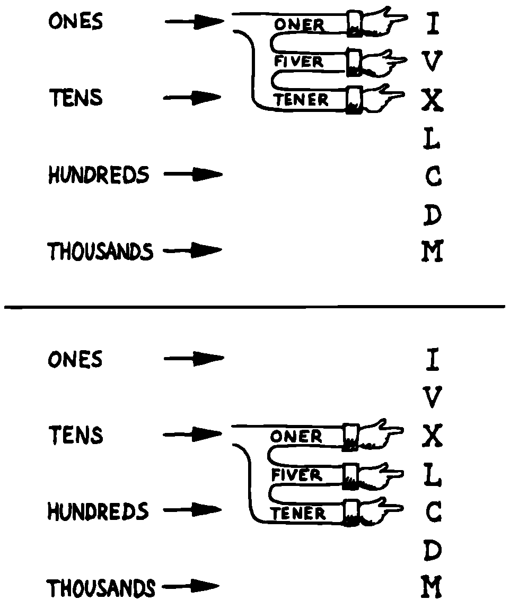

Solving a Problem: Computing Roman Numerals
===========================================

In this section we’ll attempt to demonstrate the process of designing a
lexicon. Rather than merely present the problem and its solution, I’m
hoping we can crack this problem together. (I kept a record of my
thought processes as I solved this problem originally.) You’ll see
elements of the problem-solving guidelines previously given, but you’ll
also see them being applied in a seemingly haphazard order—just as they
would be in reality.

Here goes: The problem is to write a definition that consumes a number
on the stack and displays it as a Roman numeral.

This problem most likely represents a component of a larger system.
We’ll probably end up defining several words in the course of solving
this problem, including data structures. But this particular lexicon
will include only one name, , and it will take its argument from the
stack. (Other words will be internal to the component.)

Having thus decided on the external syntax, we can now proceed to devise
the algorithms and data structures.

We’ll follow the scientific method—we’ll observe reality, model a
solution, test it against reality, modify the solution, and so on. We’ll
begin by recalling what we know about Roman numerals.

Actually, we don’t remember any formal rules about Roman numerals. But
if you give us a number, we can make a Roman numeral out of it. We know
how to do it—but we can’t yet state the procedure as an algorithm.

So, let’s look at the first ten Roman numerals:

We make a few observations. First, there’s the idea of a tally, where we
represent a number by making that many marks (3 = III). On the other
hand, special symbols are used to represent groups (5 = V). In fact, it
seems we can’t have more than three I’s in a row before we use a larger
symbol.

Second, there’s a symmetry around five. There’s a symbol for five (V),
and a symbol for ten (X). The pattern I, II, III repeats in the second
half, but with a preceding V.

One-less-than-five is written IV, and one-less-than-ten is written IX.
It seems that putting an “I” in front of a larger-value symbol is like
saying “one-less-than…”

These are vague, hazy observations. But that’s alright. We don’t have
the whole picture yet.

Let’s study what happens above ten:

This is exactly the pattern as before, with an extra “X” in front. So
there’s a repeating cycle of ten, as well.

If we look at the twenties, they’re the same, with two “X”s; the
thirties with three “X”s. In fact, the number of “X” is the same as the
number in the tens column of the original decimal number.

This seems like an important observation: we can decompose our decimal
number into decimal digits, and treat each digit separately. For
instance, 37 can be written as

    XXX (thirty)

followed by

    VII (seven)

It may be premature, but we can already see a method by which Forth will
let us decompose a number into decimal digits—with modulo division by
ten. For instance, if we say

37 10 /MOD

we’ll get a 7 and a 3 on the stack (the three—being the quotient—is on
top.)

But these observations raise a question: What about below ten, where
there is no ten’s place? Is this a special case? Well, if we consider
that each “X” represents ten, then the absence of “X” represents zero.
So it’s *not* a special case. Our algorithm works, even for numbers less
than ten.

Let’s continue our observations, paying special attention to the cycles
of ten. We notice that forty is “XL.” This is analogous to 4 being “IV,”
only shifted by the value of ten. The “X” before the “L” says
“ten-less-than-fifty.” Similarly,

Apparently the same patterns apply for any decimal digit—only the
symbols themselves change. Anyway, it’s clear now that we’re dealing
with an essentially decimal system.

If pressed to do so, we could even build a model for a system to display
Roman numerals from 1 to 99, using a combination of algorithm and data
structure.

Data Structure
--------------

+----+----------+--------+----+----+-----+--------+
|    | to 3em   |        |    |    |     |        |
+----+----------+--------+----+----+-----+--------+
|    | 0        |        |    |    | 0   |        |
+----+----------+--------+----+----+-----+--------+
|    | 1        | I      |    |    | 1   | X      |
+----+----------+--------+----+----+-----+--------+
|    | 2        | II     |    |    | 2   | XX     |
+----+----------+--------+----+----+-----+--------+
|    | 3        | III    |    |    | 3   | XXX    |
+----+----------+--------+----+----+-----+--------+
|    | 4        | IV     |    |    | 4   | XL     |
+----+----------+--------+----+----+-----+--------+
|    | 5        | V      |    |    | 5   | L      |
+----+----------+--------+----+----+-----+--------+
|    | 6        | VI     |    |    | 6   | LX     |
+----+----------+--------+----+----+-----+--------+
|    | 7        | VII    |    |    | 7   | LXX    |
+----+----------+--------+----+----+-----+--------+
|    | 8        | VIII   |    |    | 8   | LXXX   |
+----+----------+--------+----+----+-----+--------+
|    | 9        | IX     |    |    | 9   | XC     |
+----+----------+--------+----+----+-----+--------+

Algorithm
---------

Divide :math:`n` by 10. The quotient is the tens’ column digit; the
remainder is the ones’ column digit. Look up the ten’s digit in the
tens’ table and print the corresponding symbol pattern. Look up the
ones’ digit in the one’s table and print that corresponding symbol
pattern.

For example, if the number is 72, the quotient is 7, the remainder is 2.
7 in the tens’ table corresponds to “LXX,” so print that. 2 in the ones’
column corresponds to “II,” so print that. The result:

    LXXII

We’ve just constructed a model that works for numbers from one to 99.
Any higher number would require a hundreds’ table as well, along with an
initial division by 100.

The logical model just described might be satisfactory, as long as it
does the job. But somehow it doesn’t seem we’ve fully solved the
problem. We avoided figuring out how to produce the basic pattern by
storing all possible combinations in a series of tables. Earlier in this
chapter we observed that calculating an answer, if it’s possible, can be
easier than using a data structure.

Since this section deals with devising algorithms, let’s go all the way.
Let’s look for a general algorithm for producing any digit, using only
the elementary set of symbols. Our data structure should contain only
this much information:

In listing the symbols, we’ve also *organized* them in a way that seems
right. The symbols in the left column are all multiples of ten; the
symbols in the right column are multiples of five. Furthermore, the
symbols in each row have ten times the value of the symbols directly
above them.

Another difference, the symbols in the first column can all be combined
in multiples, as “XXXIII.” But you can’t have multiples of any of the
right-column symbols, such as VVV. Is this observation useful? Who
knows?

Let’s call the symbols in the left column and in the right column . The
represent the values 1, 10, 100, and 1,000; that is, the value of one in
every possible decimal place. The represent 5, 50, and 500; that is, the
value of five in every possible decimal place.

Using these terms, instead of the symbols themselves, we should be able
to express the algorithm for producing any digit. (We’ve factored out
the actual symbols from the *kind* of symbols.) For instance, we can
state the following preliminary algorithm:

For any digit, print as many as necessary to add up to the value.

Thus, for 300 we get “CCC,” for 20 we get “XX” for one we get “I.” And
for 321 we get “CCCXXI.”

This algorithm works until the digit is 4. Now we’ll have to expand our
algorithm to cover this exception:

Print as many as necessary to add up to the value, but if the digit is
4, print a then a . Hence, 40 is “XL”; 4 is “IV.”

This new rule works until the digit is 5. As we noticed before, digits
of five and above begin with a symbol. So we expand our rule again:

If the digit is 5 or more, begin with a and subtract five from the
value; otherwise do nothing. Then print as many as necessary to add up
to the value. But if the digit is 4, print only a and a .

This rule works until the digit is 9. In this case, we must print a
preceding a—what? A from the next higher decimal place (the next row
below). Let’s call this a . Our complete model, then is:

If the digit is 5 or more, begin with a and subtract five from the
value; otherwise do nothing. Then, print as many as necessary to add up
to the value. But if the digit is 4, print only a and a , or if it’s 9,
print only a and a .

We now have an English-language version of our algorithm. But we still
have some steps to go before we can run it on our computer.

In particular, we have to be more specific about the exceptions. We
can’t just say,

Do a, b, and c. *But* in such and such a case, do something different.

because the computer will do a, b, and c before it knows any better.

Instead, we have to check whether the exceptions apply *before* we do
anything else.

In devising an algorithm, consider exceptions last. In writing code,
handle exceptions first.

This tells us something about the general structure of our
digit-producing word. It will have to begin with a test for the 4/9
exceptions. In either of those cases, it will respond accordingly. If
neither exception applies, it will follow the “normal” algorithm. Using
pseudocode, then:

: DIGIT ( n ) 4-OR-9? IF special cases ELSE normal case THEN ;

An experienced Forth programmer would not actually write out this
pseudocode, but would more likely form a mental image of the structure
for eliminating the special cases. A less experienced programmer might
find it helpful to capture the structure in a diagram, or in code as
we’ve done here.

In Forth we try to minimize our dependence on logic. But in this case we
need the conditional because we have an exception we need to eliminate.
Still, we’ve minimized the complexity of the control structure by
limiting the number of s in this definition to one.

Yes, we still have to distinguish between the 4-case and the 9-case, but
we’ve deferred that structural dimension to lower-level definitions—the
test for 4-or-9 and the “special case” code.

What our structure really says is that either the 4-exception or the
9-exception must prohibit execution of the normal case. It’s not enough
merely to test for each exception, as in this version:

: DIGIT ( n ) 4-CASE? IF ONER FIVER THEN 9-CASE? IF ONER TENER THEN
normal case... ;

because the normal case is never excluded. (There’s no way to put an
just before the normal case, because must appear between and .)

If we insist on handling the 4-exception and the 9-exception separately,
we could arrange for each exception to pass an additional flag,
indicating that the exception occurred. If either of these flags is
true, then we can exclude the normal case:

: DIGIT ( n ) 4-CASE? &poorbfDUP IF ONER FIVER THEN 9-CASE? &poorbfDUP
IF ONER TENER THEN OR NOT IF normal case THEN ;

But this approach needlessly complicates the definition by adding new
control structures. We’ll leave it like it was.

Now we have a general idea of the structure of our main definition.

We stated, “If the digit is 5 or more, begin with a and subtract five
from the value; otherwise do nothing. Then, print as many as necessary
to add up to the value.”

A direct translation of these rules into Forth would look like this:

( n) DUP 4 > IF FIVER 5 - THEN ONERS

This is technically correct, but if we’re familiar with the technique of
modulo division, we’ll see this as a natural situation for modulo
division by 5. If we divide the number by five, the quotient will be
zero (false) when the number is less than five, and one (true) when it’s
between 5 and 9. We can use it as the boolean flag to tell whether we
want the leading :

( n ) 5 / IF FIVER THEN ...

The quotient/flag becomes the argument to .

Furthermore, the remainder of modulo 5 division is always a number
between 0 and 4, which means that (except for our exception) we can use
the remainder directly as the argument to . We revise our phrase to

( n ) 5 &poorbf/MOD IF FIVER THEN &poorbfONERS

Getting back to that exception, we now see that we can test for both 4
and 9 with a single test—namely, if the remainder is 4. This suggests
that we can do our 5 first, then test for the exception. Something like
this:

: DIGIT ( n ) 5 /MOD &poorbfOVER 4 = IF special case ELSE IF FIVER THEN
ONERS THEN ;

(Notice that we ed the remainder so that we could compare it with 4
without consuming it.)

So it turns out we *do* have a doubly-nested construct after all. But it
seems justified because the is handling the special case. The other is
such a short phrase, “,” it’s hardly worth making into a separate
definition. You could though. (But we won’t.)

Let’s focus on the code for the special case. To state its algorithm:
“If the digit is four, print a and a . If the digit is nine, print a and
a .”

We can assume that the digit will be one or the other, or else we’d
never be executing this definition. The question is, how do we tell
which one?

Again, we can use the quotient of division by five. If the quotient is
zero, the digit must have been four; otherwise it was nine. So we’ll
play the same trick and use the quotient as a boolean flag. We’ll write:

: ALMOST ( quotient ) IF ONER TENER ELSE ONER FIVER THEN ;

In retrospect, we notice that we’re printing a either way. We can
simplify the definition to:

: ALMOST ( quotient ) ONER IF TENER ELSE FIVER THEN ;

We’ve assumed that we have a quotient on the stack to use. Let’s go back
to our definition of and make sure that we do, in fact:

: DIGIT ( n ) 5 /MOD OVER 4 = IF &poorbfALMOST ELSE IF FIVER THEN ONERS
THEN ;

It turns out that we have not only a quotient, but a remainder
underneath as well. We’re keeping both on the stack in the event we
execute the clause. The word , however, only needs the quotient. So, for
symmetry, we must the remainder like this:

: DIGIT ( n ) 5 /MOD OVER 4 = IF ALMOST &poorbfDROP ELSE IF FIVER THEN
ONERS THEN ;

There we have the complete, coded definition for producing a single
digit of a Roman numeral. If we were desperate to try it out before
writing the needed auxiliary definitions, we could very quickly define a
lexicon of words to print one group of symbols, say the row:

: ONER .“ I” ; : FIVER .“ V” ; : TENER .“ X” ; : ONERS ( # of oners – )
?DUP IF 0 DO ONER LOOP THEN ;

before loading our definitions of and .

But we’re not that desperate. No, we’re anxious to move on to the
problem of defining the words , , and so that their symbols depend on
which decimal digit we’re formatting.

Let’s go back to the symbol table we drew earlier:

We’ve observed that we also need a “”—which is the in the next row
below. It’s as if the table should really be written:

But that seems redundant. Can we avoid it? Perhaps if we try a different
model, perhaps a linear table, like this:

Now we can imagine that each column name (“ones,” “tens,” etc.) points
to the of that column. From there we can also get each column’s by
reaching down one slot below the current , and the by reaching down two
slots.

It’s like building an arm with three hands. We can attach it to the
column, as in a, or we can attach it to the tens’ column, as in b, or to
any power of ten.

   structure.
   

    structure.

An experienced Forth programmer is not likely to imagine arms, hands, or
things like that. But there must be a strong mental image—the stuff of
right-brain thinking—before there’s any attempt to construct the model
with code.

Beginners who are learning to think in this right-brain way might find
the following tip helpful:

If you have trouble thinking about a conceptual model, visualize it—or
draw it—as a mechanical device.

Our table is simply an array of characters. Since a character requires
only a byte, let’s make each “slot” one byte. We’ll call the table :

CREATE ROMANS ( ones) ASCII I C, ASCII V C, ( tens) ASCII X C, ASCII L
C, ( hundreds) ASCII C C, ASCII D C, ( thousands) ASCII M C,

Note: This use of requires that be “-dependent” (see ). If the word is
not defined in your system, or if it is not state-dependent, use:

CREATE ROMANS 73 C, 86 C, 88 C, 76 C, 67 C, 68 C, 77 C,

We can select a particular symbol from the table by applying two
different offsets at the same time. One dimension represents the decimal
place: ones, tens, hundreds, etc. This dimension is made “current,” that
is, its state stays the same until we change it.

The other dimension represents the kind of symbol we want—, , —within
the current decimal column. This dimension is incidental, that is, we’ll
specify which symbol we want each time.

Let’s start by implementing the “current” dimension. We need some way to
point to the current decimal column. Let’s create a variable called
(pronounced “column-number”) and have it contain an offset into the
table:

VARIABLE COLUMN# ( current offset) : ONES O COLUMN# ! ; : TENS 2 COLUMN#
! ; : HUNDREDS 4 COLUMN# ! ; : THOUSANDS 6 COLUMN# ! ;

Now we can find our way to any “arm position” by adding the contents of
to the beginning address of the table, given by :

: COLUMN ( – adr-of-column) ROMANS COLUMN# @ + ;

Let’s see if we can implement one of the words to display a symbol.
We’ll start with .

The thing we want to do in is a character.

: ONER EMIT ;

Working backward, requires the ASCII character on the stack. How do we
get it there? With .

: ONER C@ EMIT ;

requires the *address* of the slot that contains the symbol we want. How
do we get that address?

The is the first “hand” on the movable arm—the position that is already
pointing to. So, the address we want is simply the address returned by :

: ONER COLUMN C@ EMIT ;

Now let’s write . It computes the same slot address, then adds one to
get the next slot, before fetching the symbol and emitting it:

: FIVER COLUMN 1+ C@ EMIT ;

And is:

: TENER COLUMN 2+ C@ EMIT ;

These three definitions are redundant. Since the only difference between
them is the incidental offset, we can factor the incidental offset out
from the rest of the definitions:

: .SYMBOL ( offset) COLUMN + C@ EMIT ;

Now we can define:

: ONER O .SYMBOL ; : FIVER 1 .SYMBOL ; : TENER 2 .SYMBOL ;

All that remains for us to do now is to decompose our complete decimal
number into a series of decimal digits. Based on the observations we’ve
already made, this should be easy. shows our completed listing.

Voila! From problem, to conceptual model, to code.

Note: this solution is not optimal. The present volume does not address
the optimization phase.

One more thought: Depending on who uses this application, we may want to
add error-checking. Fact is, the highest symbol we know is M; the
highest value we can represent is 3,999, or MMMCMXCIX.

We might redefine ROMAN as follows:

: ROMAN ( n) DUP 3999 > ABORT“ Too large” ROMAN ;

:

There’s a definite sense of rightness when you’ve done it right. It may
be that feeling that distinguishes Forth from other languages, where you
never feel you’ve really done well. In Forth, it’s the “Aha!” reaction.
You want to run off and tell somebody.

Of course, nobody will appreciate it like you do.

 Roman numerals 8/18/83 CREATE ROMANS ( ones) ASCII I C, ASCII V C, (
tens) ASCII X C, ASCII L C, ( hundreds) ASCII C C, ASCII D C, (
thousands) ASCII M C, VARIABLE COLUMN# ( current\_offset) : ONES O
COLUMN# ! ; : TENS 2 COLUMN# ! ; : HUNDREDS 4 COLUMN# ! ; : THOUSANDS 6
COLUMN# ! ;

: COLUMN ( – address-of-column) ROMANS COLUMN# @ + ;

 Roman numerals cont’d 8/18/83 : .SYMBOL ( offset – ) COLUMN + C@ EMIT ;
: ONER O .SYMBOL ; : FIVER 1 .SYMBOL ; : TENER 2 .SYMBOL ;

: ONERS ( #-of-oners – ) ?DUP IF O DO ONER LOOP THEN ; : ALMOST (
quotient-of-5/ – ) ONER IF TENER ELSE FIVER THEN ; : DIGIT ( digit – ) 5
/MOD OVER 4 = IF ALMOST DROP ELSE IF FIVER THEN ONERS THEN ;

 Roman numerals cont’d 8/18/83 : ROMAN ( number –) 1000 /MOD THOUSANDS
DIGIT 100 /MOD HUNDREDS DIGIT 10 /MOD TENS DIGIT ONES DIGIT ;

[fig-fig4-9]
