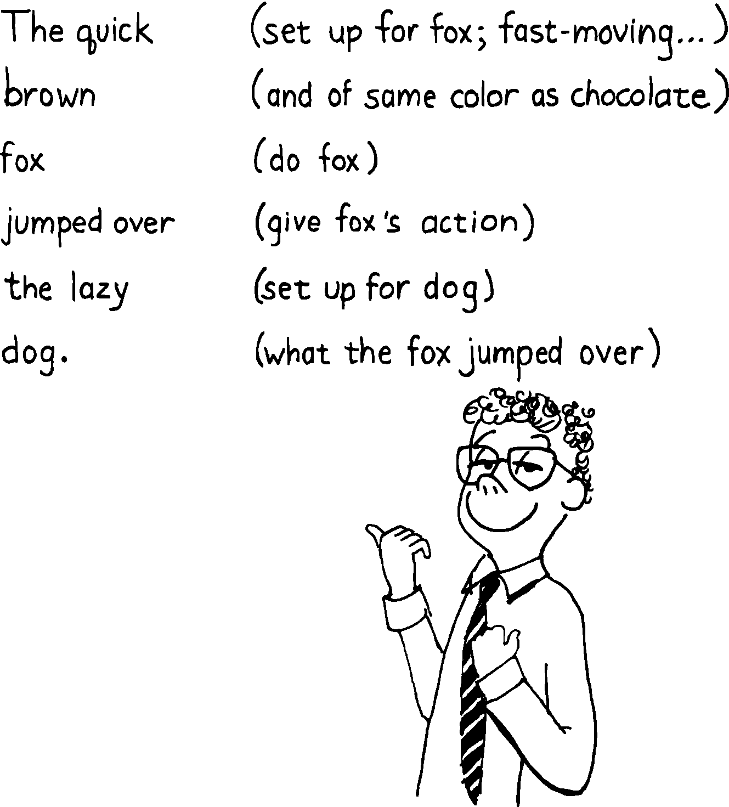

Vertical Format vs. Horizontal Format
=====================================

The purpose of commenting is to allow a reader of your code to easily
determine what’s going on. But how much commenting is necessary? To
determine the level of commenting appropriate for your circumstances,
you must ask yourself two questions:

-  Who will be reading my code?

-  How readable are my definitions?

There are two basic styles of commenting to choose from. The first
style, often called the “vertical format,” includes a step-by-step
description of the process, in the manner of a well-commented assembly
language listing. These line-by-line comments are called “narrative
comments.”

 CRC Checksum 07/15/83 : ACCUMULATE ( oldcrc char – newcrc) 256 \*
 shift char to hi-order byte XOR  & xor into previous crc 8 0 DO  Then
for eight repetitions, DUP 0< IF  if hi-order bit is “1” 16386 XOR  xor
it with mask and DUP +  shift it left one place 1+  set lo-order bit to
“1” ELSE  otherwise, i.e. hi-order bit is “0” DUP +  shift it left one
place THEN LOOP ;  complete the loop

The other approach does not intersperse narrative comments between code
phrases. This is called the “horizontal format.”

: ACCUMULATE ( oldcrc char – newcrc) 256 \* XOR 8 0 DO DUP 0< IF 16386
XOR DUP + 1+ ELSE DUP + THEN LOOP ;

The vertical format is preferred when a large team of programmers are
coding and maintaining the application. Typically, such a team will
include several junior-level programmers responsible for minor
corrections. In such an environment, diligent commenting can save a lot
of time and upset. As of Moore Products Co. says: “When maintaining code
you are usually interested in just one small section, and the more
information written there the better your chances for a speedy fix.”

Here are several pertinent rules required of the Forth programmers at
Moore Products Co. (I’m paraphrasing):

#. A vertical format will be used. Comments will appear to the right of
   the source code, but may continue to engulf the next line totally if
   needed.

#. There should be more comment characters than source characters. (The
   company encourages long descriptive names, greater than ten
   characters, and allows the names to be counted as comment
   characters.)

#. Any conditional structure or application word should appear on a
   separate line. “Noise words” can be grouped together. Indentation is
   used to show nested conditionals.

There are some difficulties with this format, however. For one thing,
line-by-line commenting is time-consuming, even with a good screen
editor. Productivity can be stifled, especially when stopping to write
the comments breaks your chain of thought.

Also, you must also carefully ensure that the comments are up-to-date.
Very often code is corrected, the revision is tested, the change
works—and the programmer forgets to change the comments. The more
comments there are, the more likely they are to be wrong. If they’re
wrong, they’re worse than useless.

This problem can be alleviated if the project supervisor carefully
reviews code and ensures the accuracy of comments.

Finally, line-by-line commenting can allow a false sense of security.
Don’t assume that because each *line* has a comment, the *application*
is well-commented. Line-by-line commenting doesn’t address the
significant aspects of a definition’s operation. What, for instance, is
the thinking behind the checksum algorithm used? Who knows, from the
narrative comments?

To properly describe, in prose, the implications of a given procedure
usually requires many paragraphs, not a single phrase. Such descriptions
properly belong in auxiliary documentation or in the chapter preamble.

Despite these cautions, many companies find the vertical format
necessary. Certainly a team that is newly exposed to Forth should adopt
it, as should any very large team.

What about the horizontal format? Perhaps it’s an issue of art vs.
practicality, but I feel compelled to defend the horizontal format as
equally valid and in some ways superior.

If Forth code is really well-written, there should be nothing ambiguous
about it. This means that:

-  supporting lexicons have a well-designed syntax

-  stack inputs and outputs are commented

-  the purpose is commented (if it’s not clear from the name or stack
   comment)

-  definitions are not too long

-  not too many arguments are passed to a single definition via the
   stack (see “The Stylish Stack” in ).

Forth is simply not like other languages, in which line-by-line
commenting is one of the few things you can do to make programs more
readable.

Skillfully written Forth code is like poetry, containing precise meaning
that both programmer and machine can easily read. Your *goal* should be
to write code that does not need commenting, even if you choose to
comment it. Design your application so that the code, not the comments,
conveys the meaning.

If you succeed, then you can eliminate the clutter of excessive
commenting, achieving a purity of expression without redundant
explanations.

   
   Wiggins, proud of his commenting technique.

The most-accurate, least-expensive documentation is self-documenting
code.

Unfortunately, even the best programmers, given the pressure of a
deadline, may write working code that is not easily readable without
comments. If you are writing for yourself, or for a small group with
whom you can verbally communicate, the horizontal format is ideal.
Otherwise, consider the vertical format.
