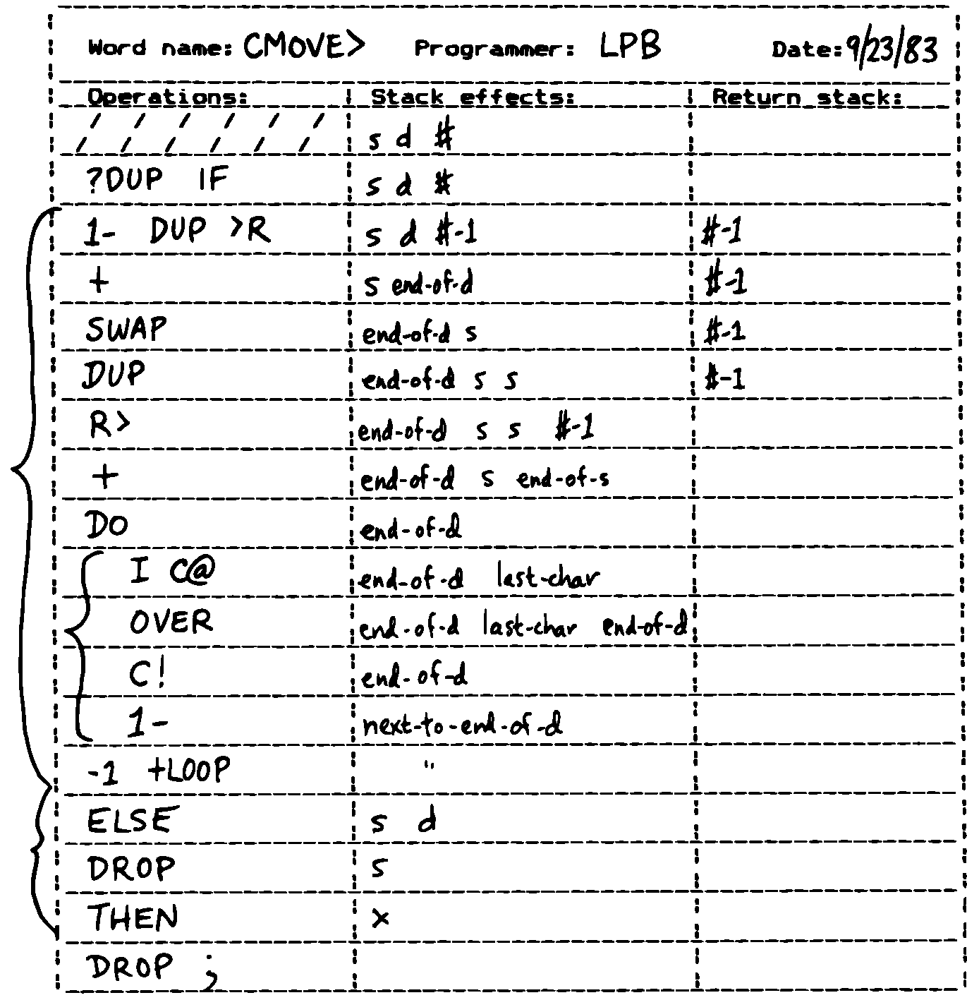

The Stylish Stack
=================

The simplest way for Forth words to pass arguments to each other is via
the stack. The process is “simple” because all the work of pushing and
popping values to and from the stack is implicit.

:

The data stack uses this idea of “hidden information.” The arguments
being passed between subroutines are not explicit in the calling
sequence. The same argument might ripple through a whole lot of words
quite invisibly, even below the level of awareness of the programmer,
simply because it doesn’t have to be referred to explicitly.

One important result of this approach: Arguments are unnamed. They
reside on the stack, not in named variables. This effect is one of the
reasons for Forth’s elegance. At the same time it’s one of the reasons
badly written Forth code can be unreadable. Let’s explore this paradox.

The invention of the stack is analogous to that of pronouns in English.
Consider the passage:

Take this gift, wrap it in tissue paper and put it in a box.

Notice the word “gift” is mentioned only once. The gift is referred to
henceforth as “it.”

The informality of the “it” construct makes English more readable
(provided the reference is unambiguous). So with the stack, the implicit
passing of arguments makes code more readable. We emphasize the
*processes*, not the *passing of arguments* to the processes.

Our analogy to pronouns suggests why bad Forth can be so unreadable. The
spoken language gets confusing when too many things are referred to with
pronouns.

Take off the wrapping and open the box. Remove the gift and throw it
away.

The problem with this passage is that we’re using “it” to refer to too
many things at once. There are two solutions to this error. The easiest
solution is to supply a real name instead of “it”:

Remove the wrapping and open the box. Take out the gift and throw *the
box* away.

Or we can introduce the words “former” and “latter.” But the best
solution is to redesign the passage:

Remove the wrapping and open the present. Throw away the box.

So in Forth we have analogous observations:

Simplify code by using the stack. But don’t stack too deeply within any
single definition. Redesign, or, as a last resort, use a named variable.

Some newcomers to Forth view the stack the way a gymnast views a
trampoline: as a fun place to bounce around on. But the stack is meant
for data-passing, not acrobatics.

So how deep is “too deep?” Generally, three elements on the stack is the
most you can manage within a single definition. (In double-length
arithmetic, each “element” occupies two stack positions but is logically
treated as a single element by operators such as , , etc.)

In your ordinary lexicon of stack operators, is the only one that gives
you access to the third stack item. Aside from and (which we’ll comment
on soon), there’s no easy way to get at anything below that.

To stretch our analogy to the limit, perhaps three elements on the stack
corresponds to the three English pronouns “this,” “that,” and “t’other.”

Redesign
--------

Let’s witness a case where a wrong-headed approach leads to a messy
stack problem. Suppose we’re trying to write the definition of (see ,
“Listing Organization” section, “Relative Loading” subsection). We’ve
decided that our loop body will be

... DO I LOAD LOOP ;

that is, we’ll put in a loop, then arrange for the index and limit to
correspond to the absolute screens being loaded.

On the stack initially we have:

lo hi

where “lo” and “hi” are the *offsets* from .

We need to permute them for , like this:

hi+1+blk lo+blk

Our biggest problem is adding the value of to both offsets.

We’ve already taken a wrong turn but we don’t know it yet. So let’s
proceed. We try:

lo hi BLK @ lo hi blk SWAP lo blk hi OVER lo blk hi blk + lo blk hi+blk
1+ lo blk hi+blk+1 ROT ROT hi+blk+1 lo blk + hi+blk+1 lo+blk

We made it, but what a mess!

If we’re gluttons for punishment, we might make two more stabs at it
arriving at:

BLK @ DUP ROT + 1+ ROT ROT +

and

BLK @ ROT OVER + ROT ROT + 1+ SWAP

All three sequences do the same thing, but the code seems to be getting
blurrier, not better.

With experience we learn to recognize the combination as a danger sign:
the stack is too crowded. Without having to work out the alternates, we
recognize the problem: once we make two copies of “blk,” we have four
elements on the stack.

At this point, the first resort is usually the return stack:

BLK @ DUP >R + 1+ SWAP R> +

(See “The Stylish Return Stack,” coming up next.) Here we’ve ed “blk,”
saving one copy on the return stack and adding the other copy to “hi.”

Admittedly an improvement. But readable?

Next we think, “Maybe we need a named variable.” Of course, we have one
already: . So we try:

BLK @ + 1+ SWAP BLK @ +

Now it’s more readable, but it’s still rather long, and redundant too.
appears twice.

“”? That sounds familiar. Finally our neurons connect.

We look back at the source for just defined:

: +LOAD ( offset – ) BLK @ + LOAD ;

This word, , should be doing the work. All we have to write is:

: +THRU ( lo hi ) 1+ SWAP DO I +LOAD LOOP ;

We haven’t created a more efficient version here, because the work of
will be done on every pass of the loop. But we have created a cleaner,
conceptually simpler, and more readable piece of code. In this case, the
inefficiency is unnoticeable because it only occurs as each block is
loaded.

Redesigning, or rethinking the problem, was the path we should have
taken as soon as things got ugly.

Local Variables
---------------

Most of the time problems can be arranged so that only a few arguments
are needed on the stack at any one time. Occasionally, however, there’s
nothing you can do.

Here’s an example of a worst case. Assume you have a word called which
draws a line between any two points, specified as coordinates in this
order:

( x1 y1 x2 y2)

where :math:`x_1,y_1` represent the :math:`x,y` coordinates for the one
end-point, and :math:`x_2,y_2` represent the opposite end-point.

Now you have to write a box-drawing word called which takes four
arguments in this order:

( x1 y1 x2 y2)

where x1 y1 represent the :math:`x,y` coordinates for the upper
left-hand corner of the box, and x2 y2 represent the lower right-hand
corner coordinates. Not only do you have four elements on the stack,
they each have to be referred to more than once as you draw lines from
point to point.

Although we’re using the stack to get the four arguments, the algorithm
for drawing a box doesn’t lend itself to the nature of the stack. If
you’re in a hurry, it would probably be best to take the easy way out:

VARIABLE TOP ( y coordinates top of box) VARIABLE LEFT ( x “ left side)
VARIABLE BOTTOM ( y ” bottom) VARIABLE RIGHT ( x " right side) : [BOX] (
x1 y1 x2 y2) BOTTOM ! RIGHT ! TOP ! LEFT ! LEFT @ TOP @ RIGHT @ TOP @
LINE RIGHT @ TOP @ RIGHT @ BOTTOM @ LINE RIGHT @ BOTTOM @ LEFT @ BOTTOM
@ LINE LEFT @ BOTTOM @ LEFT @ TOP @ LINE ;

What we’ve done is create four named variables, one for each coordinate.
The first thing does is fill these variables with the arguments from the
stack. Then the four lines are drawn, referencing the variables.
Variables such as these that are used only within a definition (or in
some cases, within a lexicon) are called “local variables.”

I’ve been guilty many times of playing hotshot, trying to do as much as
possible on the stack rather than define a local variable. There are
three reasons to avoid this cockiness.

First, it’s a pain to code that way. Second, the result is unreadable.
Third, all your work becomes useless when a design change becomes
necessary, and the order of two arguments changes on the stack. The s, s
and s weren’t really solving the problem, just jockeying things into
position.

With this third reason in mind, I recommend the following:

Especially in the design phase, keep on the stack only the arguments
you’re using immediately. Create local variables for any others. (If
necessary, eliminate the variables during the optimization phase.)

Fourth, if the definition is extremely time-critical, those tricky stack
manipulators, (e.g., ) can really eat up clock cycles. Direct access to
variables is faster.

If it’s *really* time-critical, you may need to convert to assembler
anyway. In this case, all your stack problems fly out the door, because
all your data will be referenced either in registers or indirectly
through registers. Luckily, the definitions with the messiest stack
arguments are often the ones written in code. Our primitive is a case in
point. is another.

The approach we took with certainly beats spending half an hour juggling
items on the stack, but it is by no means the best solution. What’s
nasty about it is the expense of creating four named variables, headers
and all, solely for use within this one routine.

(If you’re target compiling an application that will not require headers
in the dictionary, the only loss will be the 8 bytes in RAM for the
variables. In Forth systems of the future, headers may be separated into
other pages of memory anyway; again the loss will be only 8 bytes.) Let
me repeat: This example represents a worst-case situation, and occurs
rarely in most Forth applications. If words are well-factored, then each
word is designed to do very little. Words that do little generally
require few arguments.

In this case, though, we are dealing with two points each represented by
two coordinates.

Can we change the design? First, may be *too* primitive a primitive. It
requires four arguments because it can draw lines between any two
points, diagonally, if necessary.

In drawing our box, we may only need perfectly vertical and horizontal
lines. In this case we can write the more powerful, but less specific,
words and to draw these lines. Each requires only *three* arguments: the
starting position’s x and y, and the length. This factoring of function
simplifies the definition of

Or we might discover that this syntax feels more natural to the user:

10 10 ORIGIN! 30 30 BOX

where sets a two-element pointer to the “origin,” the place where the
box will start (the upper left-hand corner). Then “” draws a box 30
units high and 30 units wide, relative to the origin.

This approach reduces the number of stack arguments to as part of the
design.

When determining which arguments to handle via data structures rather
than via the stack, choose the arguments that are the more permanent or
that represent a current state.

On PICK and ROLL
----------------

Some folks like the words and . They use these words to access elements
from any level on the stack. We don’t recommend them. For one thing, and
encourage the programmer to think of the stack as an array, which it is
not. If you have so many elements on the stack that you need and , those
elements should be in an array instead.

Second, they encourage the programmer to refer to arguments that have
been left on the stack by higher-level, calling definitions without
being explicitly *passed* as arguments. This makes the definition
dependent on other definitions. That’s unstructured—and dangerous.

Finally, the position of an element on the stack depends on what’s above
it, and the number of things above it can change constantly. For
instance, if you have an address at the fourth stack position down, you
can write

4 PICK @

to fetch its contents. But you must write

( n) 5 PICK !

because with “:math:`n`” on the stack, the address is now in the fifth
position. Code like this is hard to read and harder to modify.

Make Stack Drawings
-------------------

When you do have a cumbersome stack situation to solve, it’s best to
work it out with paper and pencil. Some people even make up forms, such
as the one in . Done formally like this (instead of on the back of your
phone bill), stack commentaries serve as nice auxiliary documentation.

Stack Tips
----------

Make sure that stack effects balance out under all possible control
flows.

In the stack commentary for in , the inner brace represents the contents
of the . The stack depth upon exiting the loop is the same as upon
entering it: one element. Within the outer braces, the stack result of
the clause is the same as that of the clause: one element left over.
(What that leftover element represents doesn’t matter, as symbolized by
the “x” next to .)

   
   Example of a stack commentary.

When doing two things with the same number, perform the function that
will go underneath first.

For example:

: COUNT ( a – a+1 # ) DUP C@ SWAP 1+ SWAP ;

(where you first get the count) is more efficiently written:

: COUNT ( a – a+1 # ) DUP 1+ SWAP C@ ;

(where you first compute the address).

Where possible, keep the number of return arguments the same in all
possible cases.

You’ll often find a definition which does some job and, if something
goes wrong, returns an error-code identifying the problem. Here’s one
way the stack interface might be designed:

( – error-code f \| – t)

If the flag is true, the operation was successful. If the flag is false,
it was unsuccessful and there’s another value on the stack to indicate
the nature of the error.

You’ll find stack manipulation easier, though, if you redesign the
interface to look like this:

( – error-code \| O=no-error)

One value serves both as a flag and (in case of an error) the error
code. Note that reverse-logic is used; non-zero indicates an error. You
can use any values for the error codes except zero.
