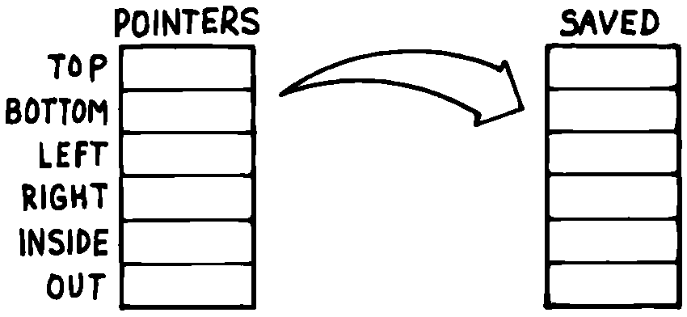
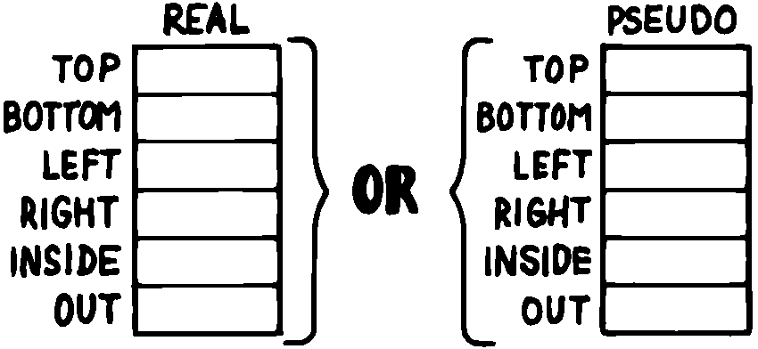

The State Table
===============

A single variable can express a single condition, either a flag, a
value, or the address of a function.

A collection of conditions together represent the *state* of the
application or of a particular component :raw-latex:`\cite{slater83}`.
Some applications require the ability to save a current state, then
later restore it, or perhaps to have a number of alternating states.

When the application requires handling a group of conditions
simultaneously, use a state table, not separate variables.

The simple case requires saving and restoring a state. Suppose we
initially have six variables representing the state of a particular
component, as shown in .

    VARIABLE TOP
    VARIABLE BOTTOM
    VARIABLE LEFT
    VARIABLE RIGHT
    VARIABLE INSIDE
    VARIABLE OUT

Now suppose that we need to save all of them, so that further processing
can take place, and later restore all of them. We could define:

: @STATE ( – top bottom left right inside out) TOP @ BOTTOM @ LEFT @
RIGHT @ INSIDE @ OUT @ ; : !STATE ( top bottom left right inside out – )
OUT ! INSIDE ! RIGHT ! LEFT ! BOTTOM ! TOP ! ;

thereby saving all the values on the stack until it’s time to restore
them. Or, we might define alternate variables for each of the variables
above, in which to save each value separately.

But a preferred technique involves creating a table, with each element
of the table referred to by name. Then creating a second table of the
same length. As you can see in , we can save the state by copying the
table, called into the second table, called .

   
   Conceptual model for saving a state table.

We’ve implemented this approach with the code in .

    0 CONSTANT POINTERS  \ address of state table PATCHED LATER
    : POSITION   ( o -- o+2 ) CREATE DUP ,  2+
       DOES>  ( -- a )  @  POINTERS + ;
    0  \ initial offset
    POSITION TOP
    POSITION BOTTOM
    POSITION LEFT
    POSITION RIGHT
    POSITION INSIDE
    POSITION OUT
    CONSTANT /POINTERS   \ final computed offset

    HERE ' POINTERS >BODY !  /POINTERS ALLOT  \ real table
    CREATE SAVED  /POINTERS ALLOT  \ saving place
    : SAVE     POINTERS  SAVED  /POINTERS CMOVE ;
    : RESTORE  SAVED  POINTERS  /POINTERS CMOVE ;

Notice in this implementation that the names of the pointers, , , etc.,
always return the same address. There is only one location used to
represent the current value of any state at any time.

Also notice that we define (the name of the table) with , not with ,
using a dummy value of zero. This is because we refer to in the defining
word , but it’s not until after we’ve defined all the field names that
we know how big the table must be and can actually it.

As soon as we create the field names, we define the size of the table as
a constant . At last we reserve room for the table itself, patching its
beginning address () into the constant . (The word converts the address
returned by tick into the address of the constant’s value.) Thus returns
the address of the table allotted later, just as a name defined by
returns the address of a table allotted directly below the name’s
header.

Although it’s valid to patch the value of a at compile time, as we do
here, there is a restriction of style:

A ’s value should never be changed once the application is compiled.

The case of alternating states is slightly more involved. In this
situation we need to alternate back and forth between two (or more)
states, never clobbering the conditions in each state when we jump to
the other state. shows the conceptual model for this kind of state
table.

   
   Conceptual model for alternating-states tables.

In this model, the names , , etc., can be made to point into either of
two tables, or . By making the table the current one, all the pointer
names reference addresses in the table; by making the table current,
they address the table.

The code in implements this alternating states mechanism. The words and
change the pointer appropriately. For instance:

    VARIABLE 'POINTERS  \ pointer to state table
    : POINTERS ( -- adr of current table)   'POINTERS @ ;
    : POSITION   ( o -- o+2 ) CREATE DUP ,  2+
       DOES>  ( -- a )  @ POINTERS + ;
    0  \ initial offset
    POSITION TOP
    POSITION BOTTOM
    POSITION LEFT
    POSITION RIGHT
    POSITION INSIDE
    POSITION OUT
    CONSTANT /POINTERS  \ final computed offset
    CREATE REAL    /POINTERS ALLOT  \ real state table
    CREATE PSEUDO  /POINTERS ALLOT  \ temporary state table
    : WORKING      REAL 'POINTERS ! ;     WORKING
    : PRETENDING   PSEUDO 'POINTERS ! ;

WORKING 10 TOP ! TOP &underline? 10 PRETENDING 20 TOP ! TOP &underline?
20 WORKING TOP &underline? 10 PRETENDING TOP &underline? 20

The major difference with this latter approach is that names go through
an extra level of indirection ( has been changed from a constant to a
colon definition). The field names can be made to point to either of two
state tables. Thus each name has slightly more work to do. Also, in the
former approach the names refer to fixed locations; a is required each
time we save or restore the values. In this approach, we have only to
change a single pointer to change the current table.
