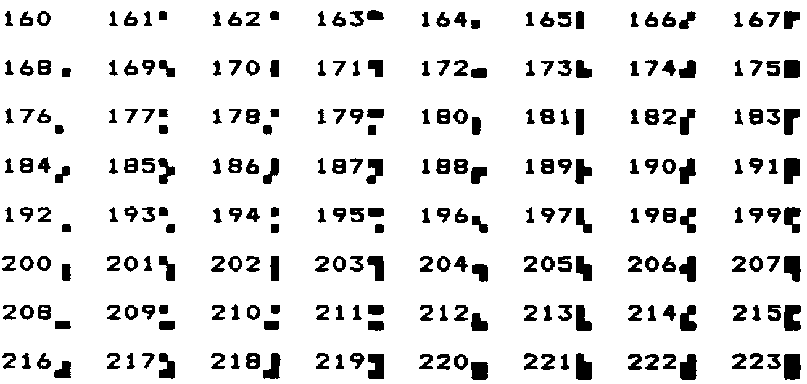

A Note on Tricks
================

This sort of approach is often labeled a “trick.” In the computing
industry at large, tricks have a bad reputation.

A trick is simply taking advantage of certain properties of operation.
Tricks are used widely in engineering applications. Chimneys eliminate
smoke by taking advantage of the fact that heat rises. Automobile tires
provide traction by taking advantage of gravity.

Arithmetic Logic Units (ALUs) take advantage of the fact that
subtracting a number is the same as adding its two’s complement.

These tricks allow simpler, more efficient designs. What justifies their
use is that the assumptions are certain to remain true.

The use of tricks becomes dangerous when a trick depends on something
likely to change, or when the thing it depends on is not protected by
information hiding.

Also, tricks become difficult to read when the assumptions on which
they’re based aren’t understood or explained. In the case of replacing
conditionals with , once this technique becomes part of every
programmer’s vocabulary, code can become *more* readable. In the case of
a trick that is specific to a specific application, such as the order in
which data are arranged in a table, the listing must clearly document
the assumption used by the trick.

Use and for clipping.

Suppose we want to decrement the contents of the variable , but we don’t
want the value to go below zero:

-1 VALUE +! VALUE @ -1 = IF O VALUE ! THEN

This is more simply written:

VALUE @ 1- O MAX VALUE !

In this case the conditional is factored within the word .

Using Decision Tables
---------------------

Use decision tables.

We introduced these in . A decision table is a structure that contains
either data (a “data table”) or addresses of functions (a “function
table”) arranged according to any number of dimensions. Each dimension
represents all the possible, mutually exclusive states of a particular
aspect of the problem. At the intersection of the “true” states of each
dimension lies the desired element: the piece of data or the function to
be performed.

A decision table is clearly a better choice than a conditional structure
when the problem has multiple dimensions.

One-Dimensional Data Table
~~~~~~~~~~~~~~~~~~~~~~~~~~

Here’s an example of a simple, one-dimensional data table. Our
application has a flag called which is true when we’re referring to
freeways, false when we’re referring to city streets.

Let’s construct the word , which returns the speed limit depending on
the current state. Using we would write:

: SPEED-LIMIT ( – speed-limit) ’FREEWAY? @ IF 55 ELSE 25 THEN ;

We might eliminate the by using a hybrid value with :

: SPEED-LIMIT 25 ’FREEWAY? @ 30 AND + ;

But this approach doesn’t match our conceptual model of the problem and
therefore isn’t very readable.

Let’s try a data table. This is a one-dimensional table, with only two
elements, so there’s not much to it:

CREATE LIMITS 25 , 55 ,

The word now must apply the boolean to offset into the data table:

: SPEED-LIMIT ( – speed-limit) LIMITS ’FREEWAY? @ 2 AND + @ ;

Have we gained anything over the approach? Probably not, with so simple
a problem.

What we have done, though, is to factor out the decision-making process
from the data itself. This becomes more cost-effective when we have more
than one set of data related to the same decision. Suppose we also had

CREATE #LANES 4 , 10 ,

representing the number of lanes on a city street and on a freeway. We
can use identical code to compute the current number of lanes:

: #LANES? ( – #lanes) #LANES ’FREEWAY? @ 2 AND + @ ;

Applying techniques of factoring, we simplify this to:

: ROAD ( for-freeway for-city ) CREATE , , DOES> ( – data ) ’FREEWAY? @
2 AND + @ ; 55 25 ROAD SPEED-LIMIT? 10 4 ROAD #LANES?

Another example of the one-dimensional data table is the “superstring”
(*Starting Forth*, Chapter Ten).

Two-Dimensional Data Table
~~~~~~~~~~~~~~~~~~~~~~~~~~

In we presented a phone-rate problem. gives one solution to the problem,
using a two-dimensional data structure.

 Telephone rates 03/30/84 CREATE FULL 30 , 20 , 12 , CREATE LOWER 22 ,
15 , 10 , CREATE LOWEST 12 , 9 , 6 , VARIABLE RATE  points to FULL,
LOWER or LOWEST  depending on time of day FULL RATE !  for instance :
CHARGE ( o – ) CREATE , DOES> ( – rate ) @ RATE @ + @ ; O CHARGE 1MINUTE
 rate for first minute 2 CHARGE +MINUTES  rate for each additional
minute 4 CHARGE /MILES  rate per each 100 miles

 Telephone rates 03/30/84 VARIABLE OPERATOR?  90 if operator assisted;
else O VARIABLE #MILES  hundreds of miles : ?ASSISTANCE ( direct-dial
charge – total charge) OPERATOR? @ + ; : MILEAGE ( – charge ) #MILES @
/MILES \* ; : FIRST ( – charge ) 1MINUTE ?ASSISTANCE MILEAGE + ; :
ADDITIONAL ( – charge) +MINUTES MILEAGE + ; : TOTAL ( #minutes – total
charge) 1- ADDITIONAL \* FIRST + ;

In this problem, each dimension of the data table consists of three
mutually exclusive states. Therefore a simple boolean (true/false) is
inadequate. Each dimension of this problem is implemented in a different
way.

The current rate, which depends on the time of day, is stored as an
address, representing one of the three rate-structure sub-tables. We can
say

FULL RATE !

or

LOWER RATE !

etc.

The current charge, either first minute, additional minute, or per mile,
is expressed as an offset into the table (0, 2, or 4).

An optimization note: we’ve implemented the two-dimensional table as a
set of three one-dimensional tables, each pointed to by . This approach
eliminates the need for a multiplication that would otherwise be needed
to implement a two-dimensional structure. The multiplication can be
prohibitively slow in certain cases.

Two-Dimensional Decision Table
~~~~~~~~~~~~~~~~~~~~~~~~~~~~~~

We’ll hark back to our Tiny Editor example in to illustrate a
two-dimensional decision table.

In we’re constructing a table of functions to be performed when various
keys are pressed. The effect is similar to that of a case statement, but
there are two modes, Normal Mode and Insert Mode. Each key has a
different behavior depending on the current mode.

The first screen implements the change of the modes. If we invoke

NORMAL MODE# !

we’ll go into Normal Mode.

INSERTING MODE# !

enters Inserting Mode.

The next screen constructs the function table, called . The table
consists of the ASCII value of a key followed by the address of the
routine to be performed when in Normal Mode, followed by the address of
the routine to be performed when in Insert Mode, when that key is
pressed. Then comes the second key, followed by the next pair of
addresses, and so on.

In the third screen, the word takes a key value, searches through the
table for a match, then returns the address of the cell containing the
match. (We preset the variable to point to the last row of the table—the
functions we want when *any* character is pressed.)

The word invokes , then adds the contents of the variable . Since will
contain either a 2 or a 4, by adding this offset we’re now pointing into
the table at the address of the routine we want to perform. A simple

@ EXECUTE

will perform the routine (or if you have it).

In fig-Forth, change the definition of to:

: IS [COMPILE] ’ CFA , ;

 Tiny Editor 2 CONSTANT NORMAL  offset in FUNCTIONS 4 CONSTANT INSERTING
  " 6 CONSTANT /KEY  bytes in table for each key VARIABLE MODE#  current
offset into table NORMAL MODE# ! : INSERT-OFF NORMAL MODE# ! ; :
INSERT-ON INSERTING MODE# ! ;

VARIABLE ESCAPE?  t=time-to-leave-loop : ESCAPE TRUE ESCAPE? ! ;

 Tiny Editor function table 07/29/83 : IS ’ , ;   function ( – ) ( for
’83 standard) CREATE FUNCTIONS  keys normal mode insert mode 4 , (
ctrl-D) IS DELETE IS INSERT-OFF 9 , ( ctrl-I) IS INSERT-ON IS INSERT-OFF
8 , ( backspace) IS BACKWARD IS INSERT< 60 , ( left arrow) IS BACKWARD
IS INSERT-OFF 62 , ( right arrow) IS FORWARD IS INSERT-OFF 27 , (
return) IS ESCAPE IS INSERT-OFF O , ( no match) IS OVERWRITE IS INSERT
HERE /KEY - CONSTANT ’NOMATCH  adr of no-match key

 Tiny Editor cont’d 07/29/83 VARIABLE MATCHED : ’FUNCTION ( key –
adr-of-match ) ’NOMATCH MATCHED ! ’NOMATCH FUNCTIONS DO DUP I @ = IF I
MATCHED ! LEAVE THEN /KEY +LOOP DROP MATCHED @ ; : ACTION ( key – )
’FUNCTION MODE# @ + @ EXECUTE ; : GO FALSE ESCAPE? ! BEGIN KEY ACTION
ESCAPE? @ UNTIL ;

In 79-Standard Forths, use:

: IS [COMPILE] ’ , ;

We’ve also used non-redundancy at compile time in the definition just
below the function table:

HERE /KEY - CONSTANT ’NOMATCH   adr of no-match key

We’re making a constant out of the last row in the function table. (At
the moment we invoke , it’s pointing to the next free cell after the
last table entry has been filled in. Six bytes back is the last row.) We
now have two words:

FUNCTIONS ( adr of beginning of function table ) ’NOMATCH ( adr of
“no-match” row; these are the routines for any key not in the table)

We use these names to supply the addresses passed to :

’NOMATCH FUNCTION DO

to set up a loop that runs from the first row of the table to the last.
We don’t have to know how many rows lie in the table. We could even
delete a row or add a row to the table, without having to change any
other piece of code, even the code that searches through the table.

Similarly the constant hides information about the number of columns in
the table.

Incidentally, the approach to taken in the listing is a quick-and-dirty
one; it uses a local variable to simplify stack manipulation. A simpler
solution that uses no local variable is:

: ’FUNCTION ( key – adr of match ) ’NOMATCH SWAP ’NOMATCH FUNCTIONS DO
DUP I @ = IF SWAP DROP I SWAP LEAVE THEN /KEY +LOOP DROP ;

(We’ll offer still another solution later in this chapter, under “Using
Structured Exits.”)

Decision Tables for Speed
-------------------------

We’ve stated that if you can calculate a value instead of looking it up
in a table, you should do so. The exception is where the requirements
for speed justify the extra complexity of a table.

Here is an example that computes powers of two to 8-bit precision:

CREATE TWOS 1 C, 2 C, 4 C, 8 C, 16 C, 32 C, : 2\*\* ( n – 2-to-the-n)
TWOS + C@ ;

Instead of computing the answer by multiplying two times itself
“:math:`n`” times, the answers are all pre-computed and placed in a
table. We can use simple addition to offset into the table and get the
answer.

In general, addition is much faster than multiplication.

provides another example:

If you want to compute trig functions, say for a graphics display, you
don’t need much resolution. A seven-bit trig function is probably
plenty. A table look-up of 128 numbers is faster than anything else
you’re going to be able to do. For low-frequency function calculations,
decision tables are great.

But if you have to interpolate, you have to calculate a function anyway.
You’re probably better off calculating a slightly more complicated
function and avoiding the table lookup.

Redesigning
-----------

One change at the bottom can save ten decisions at the top.

In our interview with at the beginning of the chapter, he mentioned that
much conditional testing could have been eliminated from an application
if it had been redesigned so that there were two words instead of one:
“You either say or you say .”

It’s easier to perform a simple, consistent algorithm while changing the
context of your environment than to choose from several algorithms while
keeping a fixed environment.

Recall from our example of the word . This was originally defined as a
variable; it was referred to many times throughout the application by
words that incremented the number of apples (when shipments arrive),
decremented the number (when apples are sold), and checked the current
number (for inventory control).

When it became necessary to handle a second type of apples, the *wrong*
approach would have been to add that complexity to all the
shipment/sales/inventory words. The *right* approach was the one we
took: to add the complexity “at the bottom”; that is, to itself.

This principle can be realized in many ways. In (under “The State
Table”) we used state tables to implement the words and , which changed
the meaning of a group of variables. Later in that chapter, we used
vectored execution to define and , to change the meanings of , , and and
thereby easily change all the formatting code that uses them.

Don’t test for something that can’t possibly happen.

Many contemporary programmers are error-checking-happy.

There’s no need for a function to check an argument passed by another
component in the system. The calling program should bear the
responsibility for not exceeding the limits of the called component.

Reexamine the algorithm.

:

A lot of conditionals arise from fuzzy thinking about the problem. In
servo-control theory, a lot of people think that the algorithm for the
servo ought to be different when the distance is great than when it is
close. Far away, you’re in slew mode; closer to the target you’re in
decelerate mode; very close you’re in hunt mode. You have to test how
far you are to know which algorithm to apply.

I’ve worked out a non-linear servo-control algorithm that will handle
full range. This approach eliminates the glitches at the transitioning
points between one mode and the other. It eliminates the logic necessary
to decide which algorithm to use. It eliminates your having to
empirically determine the transition points. And of course, you have a
much simpler program with one algorithm instead of three.

Instead of trying to get rid of conditionals, you’re best to question
the underlying theory that led to the conditionals.

Avoid the need for special handling.

One example we mentioned earlier in the book: if you keep the user out
of trouble you won’t have to continually test whether the user has
gotten into trouble.

:

Another good example is writing assemblers. Very often, even though an
opcode may not have a register associated with it, pretending that it
has a register—say, Register 0—might simplify the code. Doing arithmetic
by introducing bit patterns that needn’t exist simplifies the solution.
Just substitute zeros and keep on doing arithmetic that you might have
avoided by testing for zero and not doing it.

It’s another instance of the “don’t care.” If you don’t care, then give
it a dummy value and use it anyway.

Anytime you run into a special case, try to find an algorithm for which
the special case becomes a normal case.

Use properties of the component.

A well-designed component—hardware or software—will let you implement a
corresponding lexicon in a clean, efficient manner. The character
graphics set from the old Epson MX-80 printer (although now obsolete)
illustrates the point well. shows the graphics characters produced by
the ASCII codes 160 to 223.

   
   The Epson MX-80 graphics character set.

Each graphics character is a different combination of six tiny boxes,
either filled in or left blank. Suppose in our application we want to
use these characters to create a design. For each character, we know
what we want in each of the six positions—we must produce the
appropriate ASCII character for the printer.

A little bit of looking will tell you there’s a very sensible pattern
involved. Assuming we have a six-byte table in which each byte
represents a pixel in the pattern:

and assuming that each byte contains hex if the pixel is “on;” zero if
it is “off,” then here’s how little code it takes to compute the
character:

CREATE PIXELS 6 ALLOT : PIXEL ( i – a ) PIXELS + ; : CHARACTER ( –
graphics character) 160 6 O DO I PIXEL C@ I 2\*\* AND + LOOP ;

(We introduced a few tips back.)

No decisions are necessary in the definition of . The graphics character
is simply computed.

Note: to use the same algorithm to translate a set of six adjoining
pixels in a large grid, we can merely redefine . That’s an example of
adding indirection backwards, and of good decomposition.

Unfortunately, external components are not always designed well. For
instance, The IBM Personal Computer uses a similar scheme for graphics
characters on its video display, but without any discernible
correspondence between the ASCII values and the pattern of pixels. The
only way to produce the ASCII value is by matching patterns in a lookup
table.

:

The 68000 assembler is another example you can break your heart over,
looking for a good way to express those op-codes with the minimal number
of operators. All the evidence suggests there is no good solution. The
people who designed the 68000 didn’t have assemblers in mind. And they
could have made things a lot easier, at no cost to themselves.

By using properties of a component in this way, your code becomes
dependent on those properties and thus on the component itself. This is
excusable, though, because all the dependent code is confined to a
single lexicon, which can easily be changed if necessary.

Using Structured Exits
----------------------

Use the structured exit.

In the chapter on factoring we demonstrated the possibility of factoring
out a control structure using this technique:

: CONDITIONALLY A B OR C AND IF NOT R> DROP THEN ; : ACTIVE
CONDITIONALLY TUMBLE JUGGLE JUMP ; : LAZY CONDITIONALLY SIT EAT SLEEP ;

Forth allows us to alter the control flow by directly manipulating the
return stack. (If in doubt, see *Starting Forth*, Chapter Nine.)
Indiscreet application of this trick can lead to unstructured code with
nasty side effects. But the disciplined use of the structured exit can
actually simplify code, and thereby improve readability and
maintainability.

:

More and more I’ve come to favor to alter the flow of control. It’s
similar to the effect of an , which has an built in it. But that’s only
one in the system, not at every error.

I either abort or I don’t abort. If I don’t abort, I continue. If I do
abort, I don’t have to thread my way through the path. I short-circuit
the whole thing.

The alternative is burdening the rest of the application with checking
whether an error occurred. That’s an inconvenience.

The “abort route” circumvents the normal paths of control flow under
special conditions. Forth provides this capability with the words and .

The “structured exit” extends the concept by allowing the immediate
termination of a single word, without quitting the entire application.

This technique should not be confused with the use of GOTO, which is
unstructured to the extreme. With GOTO you can go anywhere, inside or
outside the current module. With this technique, you effectively jump
directly to the final exit point of the module (the semicolon) and
resume execution of the calling word. The word terminates the definition
in which the word appears. The phrase terminates the definition that
called the definition in which the phrase appears; thus it has the same
effect but can be used one level down. Here are some examples of both
approaches.

If you have an phrase in which no code follows , like this:

... HUNGRY? IF EAT-IT ELSE FREEZE-IT THEN ;

you can eliminate by using :

... HUNGRY? IF EAT-IT EXIT THEN FREEZE-IT ;

(If the condition is true, we eat and run; acts like a semicolon. If the
condition is false, we skip to and .)

The use of here is more efficient, saving two bytes and extra code to
perform, but it is not as readable.

comments on the value, and danger, of this technique:

Especially if your conditionals are getting elaborate, it’s handy to
jump out in the middle without having to match all your s at the end. In
one application I had a word that went like this:

: TESTING SIMPLE 1CONDITION IF ... EXIT THEN 2CONDITION IF ... EXIT THEN
3CONDITION IF ... EXIT THEN ;

SIMPLE handled the simple cases. SIMPLE ended up with . These other
conditions were the more complex ones.

Everyone exited at the same point without having to painfully match all
the s, s, and s. The final result, if none of the conditions matched,
was an error condition.

It was bad code, difficult to debug. But it reflected the nature of the
problem. There wasn’t any better scheme to handle it. The and at least
kept things manageable.

Programmers sometimes also use to get out of a complicated loop in a
graceful way. Or we might use a related technique in the that we wrote
for in our Tiny Editor, earlier in this chapter. In this word, we are
searching through a series of locations looking for a match. If we find
a match, we want to return the address where we found it; if we don’t
find a match, we want the address of the last row of the functions
table.

We can introduce the word (see ), which will work like (it will simulate
a semicolon). Now we can write:

: ’FUNCTION ( key – adr-of-match ) ’NOMATCH FUNCTIONS DO DUP I @ = IF
DROP I LEAP THEN /KEY +LOOP DROP ’NOMATCH ;

If we find a match we , not to , but right out of the definition,
leaving (the address at which we found it) on the stack. If we don’t
find a match, we fall through the loop and execute

DROP ’NOMATCH

which drops the key# being searched for, then leaves the address of the
last row!

As we’ve seen, there may be times when a premature exit is appropriate,
even multiple exit points and multiple “continue” points.

Remember though, this use of and is *not consistent* with structured
programming in the strictest sense, and requires great care.

For instance, you may have a value on the stack at the beginning of a
definition which is consumed at the end. A premature will leave the
unwanted value on the stack.

Fooling with the return stack is like playing with fire. You can get
burned. But how convenient it is to have fire.

Employing Good Timing
---------------------

Take the action when you know you need to, not later.

Any time you set a flag, ask yourself why you’re setting it. If the
answer is, “So I’ll know to do such-and-such later,” then ask yourself
if you can do such-and-such *now*. A little restructuring can greatly
simplify your design.

Don’t put off till run time what you can compile today.

Any time you can make a decision prior to compiling an application, do.

Suppose you had two versions of an array: one that did bounds checking
for your protection during development and one that ran faster, though
unprotected for the actual application.

Keep the two versions in different screens. When you compile your
application, load only the version you need.

By the way, if you follow this suggestion, you may go crazy editing
parentheses in and out of your load blocks to change which version gets
loaded each time. Instead, write throw-away definitions that make the
decisions for you. For instance (as already previewed in another
context):

: STEPPERS 150 ’TESTING? @ 1 AND + LOAD ;

a flag, don’t recreate it.

Sometimes you need a flag to indicate whether or not a previous piece of
code was invoked. The following definition leaves a flag which indicates
that was done:

: DID-I? ( – t=I-did) SHOULD-I? IF DO-IT TRUE ELSE FALSE THEN ;

This can be simplified to:

: DID-I? ( – t=I-did) SHOULD-I? DUP IF DO-IT THEN ;

Don’t set a flag, set the data.

If the only purpose to setting a flag is so that later some code can
decide between one number and another, you’re better off saving the
number itself.

The “colors” example in ’s section called “Factoring Criteria”
illustrates this point.

The purpose of the word is to set a flag which indicates whether we want
the intensity bit to be set or not. While we could have written

: LIGHT TRUE ’LIGHT? ! ;

to set the flag, and

’LIGHT? @ IF 8 OR THEN ...

to use the flag, this approach is not quite as simple as putting the
intensity bit-mask itself in the variable:

: LIGHT 8 ’LIGHT? ! ;

and then simply writing

’LIGHT? @ OR ...

to use it.

Don’t set a flag, set the function. (Vector.)

This tip is similar to the previous one, and lives under the same
restriction. If the only purpose to setting a flag is so that later some
code can decide between one function and another, you’re better off
saving the address of the function itself.

For instance, the code for transmitting a character to a printer is
different than for slapping a character onto a video display. A poor
implementation would define:

VARIABLE DEVICE ( O=video \| 1=printer) : VIDEO FALSE DEVICE ! ; :
PRINTER TRUE DEVICE ! ; : TYPE ( a # – ) DEVICE @ IF ( ...code for
printer...) ELSE ( ...code for video...) THEN ;

This is bad because you’re deciding which function to perform every time
you type a string.

A preferable implementation would use vectored execution. For instance:

DOER TYPE ( a # – ) : VIDEO MAKE TYPE ( ...code for video...) ; :
PRINTER MAKE TYPE ( ...code for printer...) ;

This is better because doesn’t have to decide which code to use, it
already knows.

(On a multi-tasked system, the printer and monitor tasks would each have
their own copies of an execution vector for stored in a user variable.)

The above example also illustrates the limitation of this tip. In our
second version, we have no simple way of knowing whether our current
device is the printer or the video screen. We might need to know, for
instance, to decide whether to clear the screen or issue a formfeed.
Then we’re making an additional use of the state, and our rule no longer
applies.

A flag would, in fact, allow the simplest implementation of additional
state-dependent operations. In the case of , however, we’re concerned
about speed. We type strings so often, we can’t afford to waste time
doing it. The best solution here might be to set the function of and
also set a flag:

DOER TYPE : VIDEO O DEVICE ! MAKE TYPE ( ...code for video...) ; :
PRINTER 1 DEVICE ! MAKE TYPE ( ...code for printer...) ;

Thus already knows which code to execute, but other definitions will
refer to the flag.

Another possibility is to write a word that fetches the parameter of the
word (the pointer to the current code) and compares it against the
address of . If it’s less than the address of , we’re using the routine;
otherwise we’re using the routine.

If changing the state involves changing a small number of functions, you
can still use /. Here are definitions of three memory-move operators
that can be shut off together.

DOER !’ ( vectorable ! ) DOER CMOVE’ ( vectorable CMOVE ) DOER FILL’ (
vectorable FILL ) : STORING MAKE !’ ! ;AND MAKE CMOVE’ CMOVE ;AND MAKE
FILL’ FILL ; : -STORING MAKE !’ 2DROP ;AND MAKE CMOVE’ 2DROP DROP ;AND
MAKE FILL’ 2DROP DROP ;

But if a large number of functions need to be vectored, a state table
would be preferable.

A corollary to this rule introduces the “structured exit hook,” a word
vectored to perform a structured exit.

DOER HESITATE ( the exit hook) : DISSOLVE HESITATE FILE-DIVORCE ;

(… Much later in the listing:)

: RELENT MAKE HESITATE SEND-FLOWERS R> DROP ;

By default, does nothing. If we invoke , we’ll end up in court. But if
we before we , we’ll send flowers, then jump clear to the semicolon,
canceling that court order before our partner ever finds out.

This approach is especially appropriate when the cancellation must be
performed by a function defined much later in the listing (decomposition
by sequential complexity). Increased complexity of the earlier code is
limited solely to defining the hook and invoking it at the right spot.

Simplifying
-----------

I’ve saved this tip for last because it exemplifies the rewards of
opting for simplicity. While other tips concern maintainability,
performance, compactness, etc., this tip relates to the sort of
satisfaction that Thoreau sought at Walden Pond.

Try to avoid altogether saving flags in memory.

A flag on the stack is quite different from a flag in memory. Flags on
the stack can simply be determined (by reading the hardware,
calculating, or whatever), pushed onto the stack, then consumed by the
control structure. A short life with no complications.

But save a flag in memory and watch what happens. In addition to having
the flag itself, you now have the complexity of a location for the flag.
The location must be:

-  created

-  initialized (even before anything actually changes)

-  reset (otherwise, passing a flag to a command leaves the flag in that
   current state).

Because flags in memory are variables, they are not reentrant.

An example of a case in which we might reconsider the need for a flag is
one we’ve seen several times already. In our “colors” example we made
the assumption that the best syntax would be:

LIGHT BLUE

that is, the adjective preceding the color. Fine. But remember the code
to implement that version? Compare it with the simplicity of this
approach:

O CONSTANT BLACK 1 CONSTANT BLUE 2 CONSTANT GREEN 3 CONSTANT CYAN 4
CONSTANT RED 5 CONSTANT MAGENTA 6 CONSTANT BROWN 7 CONSTANT GRAY : LIGHT
( color – color ) 8 OR ;

In this version we’ve reversed the syntax, so that we now say

BLUE LIGHT

We establish the color, then we modify the color.

We’ve eliminated the need for a variable, for code to fetch from the
variable and more code to reset the variable when we’re done. And the
code is so simple it’s impossible not to understand.

When I first wrote these commands, I took the English-like approach. “”
sounded backwards, not at all acceptable. That was before my
conversations with .

’s philosophy is persuasive:

I would distinguish between reading nicely in English and reading
nicely. In other languages such as Spanish, adjectives follow nouns. We
should be independent of details like which language we’re thinking in.

It depends on your intention: simplicity, or emulation of English.
English is not such a superb language that we should follow it
slavishly.

If I were selling my “colors” words in a package for graphic artists, I
would take the trouble to create the flag. But writing these words for
my own use, if I had to do it over again, I’d favor the -ish influence,
and use “.”
